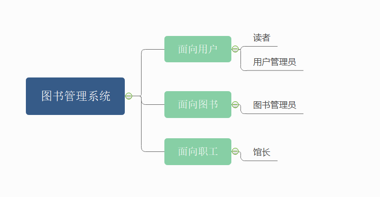
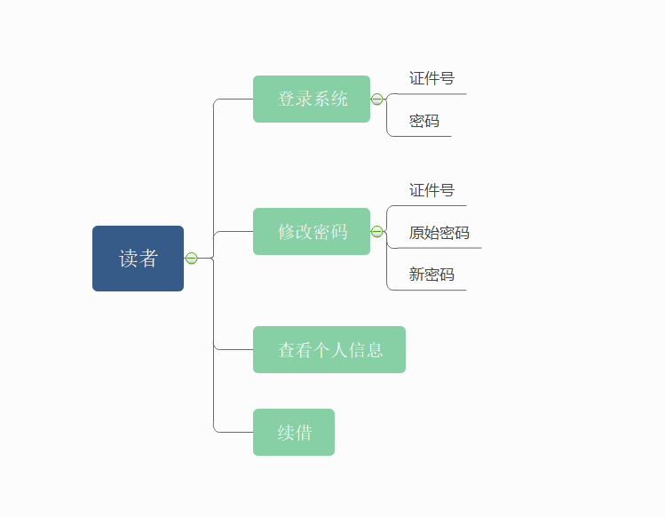
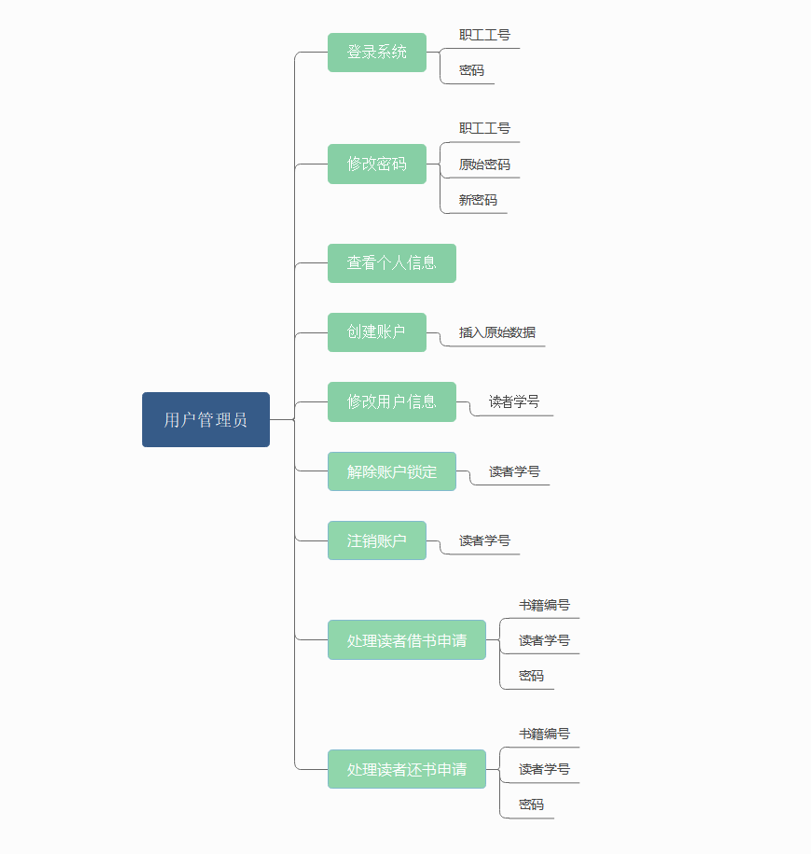
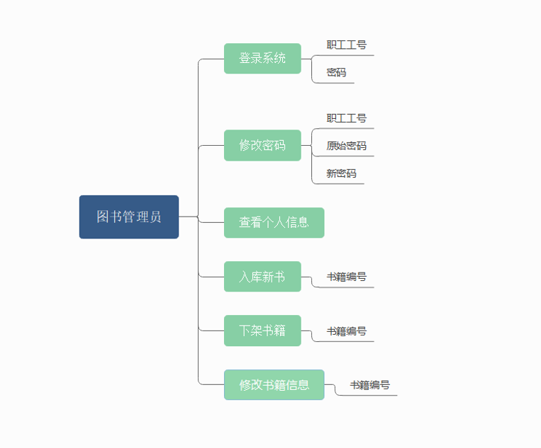
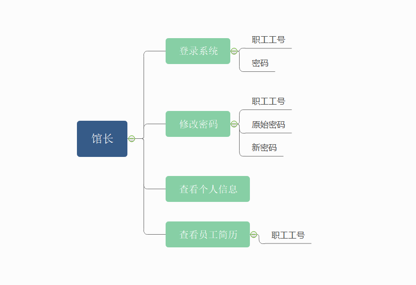

# 0、软件评测依据

**评分标准：**

¨**数据设计合理**  **30%**

¨**基本功能正确**  **20%**

¨**用户界面美观**  **10%**

¨**系统操作方便**  **10%**

¨**模块结构清晰**  **10%**

¨**程序命名规范**  **10%**

¨**程序文档完整**  **10%**

==数据设计 30% ：==

- [x] **数据表**
- [x] **==用户==**
- [x] **表空间**
- [x] **主键外键**
- [x] **==索引==**
- [x] ==**视图**==
- [x] **序列**
- [x] **触发器**
- [x] **过程和函数**
- [x] **大对象**
- [ ] 其他规范：无select * 

# 1、需求分析

## 1.1、学校图书管理系统需求分析

​		学校图书管理系统的需要服务的对象为：用户、图书和职工。

​		其中，用户为读者，直接为用户服务的工作人员称为用户管理员；管理图书信息的工作人员称

为图书管理员；管理职工信息的工作人员称为馆长。

## 1.2、核心功能

#### 1.2.1、功能与角色关系

​		系统核心功能分为三类：面向用户、面向图书、面向职工。

​		系统角色分为四类：读者、用户管理员、图书管理员、馆长。

​		两部分的关系如下图所示：



#### 1.2.2、核心功能示意图

​		读者的核心功能有：**登录系统**、**修改密码**、**查看个人信息**和续借。



​		用户管理员的核心功能有：登录系统、修改密码、查看个人信息、创建账户、修改用户信息、解除账户锁定、注销账户和处理读者借还书申请。



​		图书管理员的核心功能有：登录系统、修改密码、查看个人信息、入库新书、下架书籍、修改书籍信息。



​		馆长的核心功能有：登录系统、修改密码、查看个人信息、查看员工简历。




# 2、数据库设计


## 2.1、数据表-MySQL

```sql
create table books(
    bookId varchar(50) not null ,
    title varchar(50) not null ,
    author varchar(50) not null ,
    pubDate DATE,
    press varchar(50),
    amount int not null ,
    subject varchar(18) not null ,
    price numeric(6,2),
    state varchar(50) not null ,
    primary key (bookId)
);
# 插入数据
insert into books values ('11111','现代操作系统','Andrew S.Tanenbaum',
                          date('2014-09-09'),'机械工业出版社',20,'计算机',60.00,'正常');
```

```sql
create table readers(
    readerId varchar(30) not null ,
    name varchar(30) not null ,
    sex char(1) default 'F',
    phoneNum int not null ,
    primary key (readerId)
);

# method 1
insert into readers (readerId, name, phoneNum)
values('000000','admin','123456');

# method 2
insert into readers
values ('000001','Nicer','M','111111');
```

```sql
create table credentials (
    readerId varchar(30) not null ,
    handleDate DATE not null ,
    invalidDate DATE ,
    password varchar(30) not null ,
    score int default 80,
    borrowNum int default 0,
    state varchar(16) default '正常',
    primary key (readerId),
    foreign key (readerId) references readers(readerId)
);

# 数据
insert into credentials values ('000000',date(0),null,'admin',80,0,'正常');
insert into credentials values ('000001',date(0),null,'123456',80,0,'正常');
```

## 2.2、Oracle配置


```sql
--创建表空间
create tablespace jlussm
datafile 'D:\jlussm.dbf'
size 500m
autoextend on
next 20m;

--创建用户
create user lyn
identified by lyn
default tablespace jlussm;

create user wry
identified by wry
default tablespace jlussm;

create user lly
identified by lly
default tablespace jlussm;

--给用户授权
--常用角色
connect --连接角色，基本角色
resource --开发者角色
dba --超级管理员角色

--给用户授予角色
grant dba to lyn;
grant connect to wry;
grant resource to lly;

--Blob数据插入配置
CREATE OR REPLACE DIRECTORY TEST_DIR AS 'C:\Users\Administrator\Desktop\JAVAEE\Oracle-Image'; -- 路径名 "TEST_DIR" 必须为大写
GRANT READ,WRITE ON DIRECTORY TEST_DIR TO lyn;
--通过Oracle直接插入.jpg为Blob字段
DECLARE  
  tempimg BLOB;  
  tempdir BFILE:=BFILENAME('TEST_DIR','test.jpg');  -- 从指定图片路径读test.jpg
  BEGIN  
  INSERT INTO BOOKS_COVER(BOOKID, COVER) VALUES ('11111',EMPTY_BLOB())RETURN COVER INTO TEMPIMG;  
  DBMS_LOB.FILEOPEN(tempdir);  
  DBMS_LOB.LOADFROMFILE(tempimg,tempdir,DBMS_LOB.GETLENGTH(tempdir));
  DBMS_LOB.FILECLOSE(tempdir);  
  COMMIT;
END;

C:\Users\Administrator\Desktop\JAVAEE\ssmbuld>mvn install:install-file -DgroupId=com.oracle -DartifactId=ojdbc6 -Dversion=11.2.0.3 -Dpackaging=jar -Dfile=ojdbc6.jar
[INFO] Scanning for projects...
[INFO]
[INFO] ------------------------< org.example:ssmbuld >-------------------------
[INFO] Building ssmbuld 1.0-SNAPSHOT
[INFO] --------------------------------[ jar ]---------------------------------
[INFO]
[INFO] --- maven-install-plugin:2.4:install-file (default-cli) @ ssmbuld ---
[INFO] Installing C:\Users\Administrator\Desktop\JAVAEE\ssmbuld\ojdbc6.jar to C:\Users\Administrator\.m2\repository\com\oracle\ojdbc6\11.2.0.3\ojdbc6-11.2.0.3.jar
[INFO] Installing C:\Users\ADMINI~1\AppData\Local\Temp\mvninstall7972904160730413300.pom to C:\Users\Administrator\.m2\repository\com\oracle\ojdbc6\11.2.0.3\ojdbc6-11.2.0.3.pom
[INFO] ------------------------------------------------------------------------
[INFO] BUILD SUCCESS
[INFO] ------------------------------------------------------------------------
[INFO] Total time:  0.371 s
[INFO] Finished at: 2022-03-28T16:39:33+08:00
[INFO] ------------------------------------------------------------------------
```


## 2.3、Oracle学习

```sql
--创建一个person表
create table person(
       pid number(20),
       pname varchar2(10)
);


--序列不真的属于任何一张表，但是可以逻辑和表做绑定
--序列：默认从1开始，依次递增，主要用来给主键赋值使用
--dual: 虚表，知识为了补全语法，没有任何意义
create sequence s_person;
select s_person.nextval from dual;
select s_person.currval from dual;


insert into person(pid,pname) values (s_person.nextval,'小明');
commit;

select * from person;

--scott用户，密码tiger
--解锁scott用户
alter user scott account unlock;

--解锁scott的密码【也可重置】
alter user scott identified by tiger;


--视图--就是提供一个查询的窗口，所有数据来自原表
--查询语句创建表
create table emp as select * from scott.emp;
--创建视图【必须有dba权限】
create view v_emp as select ename, job from emp;

--查询视图
select * from v_emp;

--修改视图【不推荐】
--只读视图
create view v_emp1 as select ename, job from emp with read only;


--视图的作用：1、屏蔽敏感字段 如：salary 2、数据统一

--索引：在表的列上构建一个二叉树
----达到大幅度提高查询效率的目的，但是索引会影响增删改的效率

---单列索引 触发规则：条件必须是索引列中的原始值 where ename = 'scott'
---                   单行函数，模糊查询，都会影响索引的触发
create index idx_ename on emp(ename);

---复合索引
create index idx_enamejob on emp(ename,job);


--存储过程： 提前编译好的一段pl/sql语言，防止在数据库端
-----可以直接被调用、一般都是固定步骤的业务

create or replace procedure p1(eno emp.empno%type)
is

begin
  update emp set sal = sal+100 where empno = eno;
  commit;
end;


---调用有 两种方法 sql、java
select * from emp where empno = 7788;

declare

begin
  p1(7788);
end;

--存储函数
----eg：实现指定员工的年薪 (过程的参数都不能带长度，函数的返回值类型不能带长度)
create or replace function f_yearsal(eno emp.empno% type) return number
is 
   s number(10);
begin 
  select sal*12+nvl(comm, 0)into s from emp where empno = eno;
  return s;
end;  

----测试 f_yearsal (返回值需要接收)
declare 
  s number(10);
begin
  s :=f_yearsal(7788);
  dbms_output.put_line(s);
end;


--触发器：1、语句级  
--       2、行级
--插入一条记录，输出一个新员工入职
create or replace trigger t1
after
insert
on person

declare

begin
  dbms_output.put_line('一个新员工入职');
end;

select * from person;

insert into person values(1,'小红');

--行级别触发器
--不能给员工降薪
create or replace trigger t2
before
update
on emp
for each row
declare

begin
  if :old.sal>:new.sal then
    raise_application_error(-20001,'不能给员工降薪');
  end if;
end;

----触发t2
update emp set sal=sal-1 where empno = 7788;

```


## 2.4、移植到Oracle

```sql
create table books(
    bookId varchar(50) not null ,
    title varchar(50) not null ,
    author varchar(50) not null ,
    pubDate DATE,
    press varchar(50),
    amount int not null ,
    subject varchar(18) not null ,
    price numeric(6,2),
    state varchar(50) not null ,
    primary key (bookId)
);


insert into books values ('11111','现代操作系统','Andrew S.Tanenbaum',
                          to_date('2014-09-09','YYYY-MM-DD'),
                          '机械工业出版社',20,'计算机',60.00,'正常');
                          

create table readers(
    readerId varchar2(30) not null ,
    name varchar2(30) not null ,
    sex char(1) default 'F',
    phoneNum int not null ,
    primary key (readerId)
);


create table credentials (
     readerId varchar2(30) not null ,
     handleDate DATE not null ,
     invalidDate DATE ,
     password varchar2(30) not null ,
     score int default 80,
     borrowNum int default 0,
     state varchar2(16) default '正常',
     primary key (readerId),
     foreign key (readerId) references readers(readerId)
);


create table book_state(
    bookId varchar2(50),
    title varchar2(50) not null ,
    location varchar2(50),
    remainNum int not null ,
    primary key (bookId),
    foreign key (bookId) references books(bookId)
);


create table books_cover(
    bookId varchar2(50),
    cover BLOB,
    primary key (bookId),
    foreign key (bookId) references books(bookId)
);


create table staff(
    jobId varchar2(30),
    personId varchar2(30),
    name varchar2(30) not null ,
    password varchar2(30) default '000000',
    rank varchar2(30) default '用户管理员',
    sex char(1) default 'F',
    phoneNum int,
    primary key (jobId)
);


create table entry_info(
    checkId varchar2(30),
    bookId varchar2(50),
    entryDate DATE,
    amount int not null,
    jobId varchar2(30),
    price numeric(6,2),
    primary key (checkId,bookId),
    foreign key (bookId) references books(bookId),
    foreign key (jobId) references staff(jobId)
);


create table report_book(
    checkId varchar2(30),
    bookId varchar2(50),
    jobId varchar2(30),
    reportDate DATE,
    disposeDate DATE,
    amount int,
    reason varchar2(50),
    state varchar2(18),
    primary key (checkId,bookId),
    foreign key (bookId) references books(bookId),
    foreign key (jobId) references staff(jobId)
);

create table comments(
    bookId varchar2(50),
    readerId varchar2(30),
    commentDate DATE,
    content varchar2(100),
    primary key (bookId,readerId,commentDate),
    foreign key (readerId) references readers(readerId),
    foreign key (bookId) references books(bookId)
);

create table ques_ans(
    readerId varchar2(30),
    askDate DATE,
    jobId varchar2(30),
    question varchar2(100),
    answer varchar2(100),
    primary key (readerId,askDate),
    foreign key (readerId) references readers(readerId),
    foreign key (jobId) references staff(jobId)
);

create table book_collect(
    readerId varchar2(30),
    bookId varchar2(50),
    collectDate DATE,
    primary key (readerId,bookId),
    foreign key (readerId) references readers(readerId),
    foreign key (bookId)references books(bookId)
);

create table handle_reader(
    readerId varchar2(50),
    reportDate DATE,
    jobId varchar2(30),
    disposeDate DATE,
    state varchar2(10),
    primary key (readerId,reportDate),
    foreign key (readerId) references readers(readerId),
    foreign key (jobId) references staff(jobId)
);

create table record(
    readerId varchar2(30),
    bookId varchar2(50),
    borrowDate DATE,
    state varchar2(10),
    expectDate DATE,
    returnDate DATE,
    primary key (readerId,bookId,borrowDate),
    foreign key (readerId) references readers(readerId),
    foreign key (bookId) references books(bookId)
);
```

## 2.5、数据插入

#### 1、books表

```sql
insert into books values ('11111','现代操作系统','Andrew S.Tanenbaum',
                          to_date('2014-09-09','YYYY-MM-DD'),'机械工业出版社',20,
                          '计算机',60.00,'正常');
insert into books values ('9787111599715','计算机网络','James.F.Kurose',
                          to_date('2018-06-01','YYYY-MM-DD'),'机械工业出版社',20,
                          '计算机',89.00,'正常');
insert into books values ('9787111618331','设计模式','Erich Gamma',
                          to_date('2019-05-01','YYYY-MM-DD'),'机械工业出版社',20,
                          '计算机',79.00,'正常');
insert into books values ('9787506365437','活着','余华',
                          to_date('2017-07','YYYY-MM'),'作家出版社',20,'文学',31.00,'正常');
insert into books values ('9787532734030','月亮和六便士','威廉·萨默塞特·毛姆',
                          to_date('2019-03-01','YYYY-MM-DD'),'光明日报出版社',20,'文学',
                          37.00,'正常');
insert into books values ('9787570510542','热风','鲁迅',
                          to_date('2019-06-01','YYYY-MM-DD'),'江西教育出版社',20,
                          '文学',60.00,'正常');
insert into books values ('9787519300203','中国通史','吕思勉',
                          to_date('2016-02-01','YYYY-MM-DD'),'群言出版社',20,'历史',
                          45.50,'正常');
insert into books values ('9787550280469','史记','司马迁',
                          to_date('2016-08-01','YYYY-MM-DD'),'北京联合出版公司',20,
                          '历史',198.00,'正常');
insert into books values ('9787545559804','帝国的崩裂','李奕定',
                          to_date('2020-11-01','YYYY-MM-DD'),'天地出版社',20,'历史',
                          79.00,'正常');
insert into books values ('9787030201041','内科学案例版','刘世明、罗兴林',
                          to_date('2008-05-01','YYYY-MM-DD'),'科学出版社',20,'医学',
                          158.00,'正常');
insert into books values ('9787519249496','局部解剖学','丁自海',
                          to_date('2018-11-01','YYYY-MM-DD'),'世界图书出版公司',20,
                          '医学',38.00,'正常');
insert into books values ('9787122356840','外科学','王小农、王建忠',
                          to_date('2020-03-01','YYYY-MM-DD'),'化学工业出版社',20,'医学',
                          60.00,'正常');
insert into books values ('9787107278303','标准日本语','光村图书出版株式会社',
                          to_date('2013-05-01','YYYY-MM-DD'),'人民教育出版社',20,
                          '外国语言文学',78.00,'正常');
insert into books values ('9787562832614','日语教程','Reika',
                          to_date('2012-05-01','YYYY-MM-DD'),'华东理工大学出版社',20,
                          '外国语言文学',64.00,'正常');
insert into books values ('9787513542272','书虫','吕游',
                          to_date('2014-04-01','YYYY-MM-DD'),'外语教育与研究出版社',20,
                          '外国语言文学',65.00,'正常');
insert into books values ('9787010009223','毛泽东选集','毛泽东',
                          to_date('1991-06-01','YYYY-MM-DD'),'人民出版社',20,'政治',
                          81.00,'正常');
insert into books values ('9787550218222','资本论','马克思',
                          to_date('2013-08-01','YYYY-MM-DD'),'北京联合出版公司',20,
                          '政治',49.90,'正常');
insert into books values ('9787514709858','中国制度面对面','中央宣传部理论局',
                          to_date('2020-07-01','YYYY-MM-DD'),'学习出版社',20,'政治',
                          25.00,'正常');
insert into books values ('9787010221779','中华人民共和国民法典','人民出版社',
                          to_date('2020-06-01','YYYY-MM-DD'),'人民出版社',20,'法律',
                          49.80,'正常');
insert into books values ('9787100074483','中国法律与中国社会','瞿同祖',
                          to_date('2010-12-01','YYYY-MM-DD'),'商务印书馆',20,'法律',
                          66.00,'正常');
insert into books values ('9789301312889','法学引注手册','法学引注手册编写组',
                          to_date('2020-05-01','YYYY-MM-DD'),'北京大学出版社',20,'法律',
                          28.00,'正常');
insert into books values ('9787508091044','周易','冯国超',
                          to_date('2017-02-01','YYYY-MM-DD'),'华夏出版社',20,'哲学',
                          29.00,'正常');
insert into books values ('9787550282131','道德经','老子',
                          to_date('2019-06-01','YYYY-MM-DD'),'北京联合出版公司',20,
                          '哲学',68.00,'正常');
insert into books values ('9787506046114','易经','傅佩荣',
                          to_date('2012-05-01','YYYY-MM-DD'),'东方出版社',20,'哲学',
                          64.00,'正常');
insert into books values ('9787806928622','中国钢琴音乐研究','代白生',
                          to_date('2014-01-01','YYYY-MM-DD'),'上海音乐学院出版社',20,
                          '音乐',40.00,'正常');
insert into books values ('9787806672693','钢琴基础教程','韩林申',
                          to_date('2003-05-01','YYYY-MM-DD'),'上海音乐出版社',20,
                          '音乐',42.00,'正常');
insert into books values ('9787115519955','音乐制作自学手册','陈飞',
                          to_date('2019-11-01','YYYY-MM-DD'),'人民邮电出版社',20,
                          '音乐',65.00,'正常');
insert into books values ('9787301284964','摄影美学','秦大唐、秦鹏',
                          to_date('2017-07-01','YYYY-MM-DD'),'北京大学出版社',20,
                          '摄影',79.00,'正常');
insert into books values ('9787115498489','光影艺术','Chris Knight',
                          to_date('2019-04-01','YYYY-MM-DD'),'人民邮电出版社',20,
                          '摄影',108.00,'正常');
insert into books values ('9787547430798','老照片','冯克力',
                          to_date('2019-02-01','YYYY-MM-DD'),'山东画报出版社',20,
                          '摄影',20.00,'正常');
commit ;


--第二波数据

insert into books values ('9787111213826','Java编程思想','Bruce Eckel',
                          to_date('2007-06-01','YYYY-MM-DD'),'机械工业出版社',20,
                          '计算机',108.00,'正常');
insert into books values ('9787111528395','数据结构与算法分析','Mark Allen Weiss',
                          to_date('2016-03-01','YYYY-MM-DD'),'机械工业出版社',20,
                          '计算机',69.00,'正常');   
insert into books values ('9787111636663','Java核心技术','Cay S.Horstmann',
                          to_date('2020-01-01','YYYY-MM-DD'),'机械工业出版社',20,
                          '计算机',298.00,'正常'); 
insert into books values ('9787302517597','Java从入门到精通','明日科技',
                          to_date('2019-03-01','YYYY-MM-DD'),'清华大学出版社',20,
                          '计算机',69.80,'正常');  
insert into books values ('9787513331418','第七天','余华',
                          to_date('2018-08-01','YYYY-MM-DD'),'新星出版社',20,
                          '文学',27.00,'正常'); 
insert into books values ('9787544766500','杀死一只知更鸟','Harper Lee',
                          to_date('2017-02-01','YYYY-MM-DD'),'译林出版社',20,
                          '文学',48.00,'正常');  
insert into books values ('9787506365604','在细雨中呼喊','余华',
                          to_date('2012-09-01','YYYY-MM-DD'),'作家出版社',20,
                          '文学',33.00,'正常');
insert into books values ('9787224127898','山月记','中岛敦',
                          to_date('2018-12-01','YYYY-MM-DD'),'陕西人民出版社',20,
                          '文学',26.80,'正常'); 
insert into books values ('9787508660752','人类简史','Yuval Noah Harari',
                          to_date('2017-02-01','YYYY-MM-DD'),'中信出版社',20,
                          '历史',68.00,'正常');
insert into books values ('9787108009821','万历十五年','黄仁宇',
                          to_date('2006-06-01','YYYY-MM-DD'),
                          '生活读书新知三联书店',20,'历史',26.00,'正常'); 
insert into books values ('9787516827628','趣味中国史','趣哥',
                          to_date('2020-11-01','YYYY-MM-DD'),'台海出版社',20,
                          '历史',49.80,'正常');
insert into books values ('9787108010360','中国大历史','黄仁宇',
                          to_date('2007-02-01','YYYY-MM-DD'),
                          '生活读书新知三联书店',20,'历史',35.00,'正常');           insert into books values ('9787117255561','中医入门','秦伯未',
                          to_date('2018-01-01','YYYY-MM-DD'),
                          '人民卫生出版社',20,'医学', 29.00,'正常');
insert into books values ('9787513248006','黄帝内经','徐文兵',
                          to_date('2019-09-01','YYYY-MM-DD'),
                          '中国中医药出版社',20,'医学', 59.00,'正常');             insert into books values ('9787521401554','难经','扁鹊',
                          to_date('2018-07-01','YYYY-MM-DD'),
                          '中国医药科技出版社',20,'医学', 10.00,'正常');           insert into books values ('9787802312364','伤寒论','胡希恕',
                          to_date('2019-03-01','YYYY-MM-DD'),
                          '中国中医药出版社',20,'医学', 45.00,'正常'); 
insert into books values ('9787560017273','词汇大全','新概念',
                          to_date('2000-06-01','YYYY-MM-DD'),
                          '外语教学与研究出版社',20,'外国语言文学',12.00,'正常');     insert into books values ('9787560013466','新概念英语一','何其莘',
                          to_date('2000-06-01','YYYY-MM-DD'),
                          '外语教学与研究出版社',20,'外国语言文学',29.90,'正常');     insert into books values ('9787560013473','新概念英语二','何其莘',
                          to_date('2000-06-01','YYYY-MM-DD'),
                          '外语教学与研究出版社',20,'外国语言文学',79.80,'正常');     insert into books values ('9787560018737','新概念英语三','何其莘',
                          to_date('2000-06-01','YYYY-MM-DD'),
                          '外语教学与研究出版社',20,'外国语言文学',19.90,'正常');     insert into books values ('9787503561634','习近平的七年知青岁月',
                          '中央党校采访实录编辑室',
                          to_date('2017-08-01','YYYY-MM-DD'),'中央党校出版社',20,
                          '政治',76.00,'正常'); 
insert into books values ('9787509837412','中国共产党的九十年','中央党史研究室',
                          to_date('2016-06-01','YYYY-MM-DD'),'中共党史出版社',20,
                          '政治',150.00,'正常');
insert into books values ('9787509909294','红色延安故事','中国延安干部学院',
                          to_date('2017-08-01','YYYY-MM-DD'),'党建读物出版社',20,
                          '政治',39.00,'正常');
insert into books values ('9787503565397','习近平在正定','中央党校采访实录编辑室',
                          to_date('2017-08-01','YYYY-MM-DD'),'中央党校出版社',20,
                          '政治',76.00,'正常'); 
insert into books values ('2402220000046','刑法学讲义','罗翔',
                          to_date('2020-07-01','YYYY-MM-DD'),
                          '云南人民出版社',20,'法律',68.00,'正常');
                          insert into books values ('9787544766630','论法的精神','孟德斯鸠',
                          to_date('2016-11-01','YYYY-MM-DD'),
                          '译林出版社',20,'法律',58.00,'正常');
insert into books values ('9787519742683','中国民法典新规则要点','杨立新',
                          to_date('2020-06-01','YYYY-MM-DD'),
                          '中国法律新图书有限公司',20,'法律',138.00,'正常');         insert into books values ('9787301264874','要命的选择','雨果',
                          to_date('2016-01-01','YYYY-MM-DD'),
                          '北京大学出版社',20,'法律',35.00,'正常');                 insert into books values ('9787559614032','传习录','叶圣陶',
                          to_date('2018-01-01','YYYY-MM-DD'),
                          '北京联合出版社',20,'哲学',45.00,'正常'); 
insert into books values ('9787559402035','知行合一','度阴山',
                          to_date('2018-01-01','YYYY-MM-DD'),
                          '江苏文艺出版社',20,'哲学',118.00,'正常');               insert into books values ('9787544334532','梅花易数','邵雍',
                          to_date('2011-04-01','YYYY-MM-DD'),
                          '海南出版社',20,'哲学',35.00,'正常');                   insert into books values ('9787518026517','素书全鉴','黄石公',
                          to_date('2016-08-01','YYYY-MM-DD'),
                          '中国纺织出版社',20,'哲学',68.00,'正常');                 insert into books values ('9787313177063','久石让音乐手记','久石让',
                          to_date('2017-08-01','YYYY-MM-DD'),
                           '上海交通大学出版社',20,'音乐',49.80,'正常');
insert into books values ('9787805536170','现代钢琴教程','约翰汤普森',
                          to_date('2014-08-01','YYYY-MM-DD'),
                           '上海音乐出版社',20,'音乐',86.00,'正常');               insert into books values ('9787805534404','钢琴手指练习','方百里',
                          to_date('2009-10-01','YYYY-MM-DD'),
                           '上海音乐出版社',20,'音乐',32.00,'正常');               insert into books values ('9787302526308','聆听音乐','Craig Wright',
                          to_date('2019-04-01','YYYY-MM-DD'),
                           '清华大学出版社',20,'音乐',98.00,'正常');               insert into books values ('9787121365409','摄影范谈集','范朝亮',
                          to_date('2019-06-01','YYYY-MM-DD'),'电子工业出版社',20,
                          '摄影',98.00,'正常');
insert into books values ('9787512202153','写真一瞬','本间直子',
                          to_date('2012-04-01','YYYY-MM-DD'),
                          '中国民族摄影出版社',20,'摄影',48.00,'正常');             insert into books values ('9787540250379','中国照相机锦集','王士元',
                          to_date('2018-06-01','YYYY-MM-DD'),'北京燕山出版社',20,
                          '摄影',158.00,'正常');
insert into books values ('9787115484291','一期一会','啾啾秋秋酱',
                          to_date('2018-06-01','YYYY-MM-DD'),'人民邮电出版社',20,
                          '摄影',128.00,'正常');  
                          
commit ;               
```

#### 2、readers表

```sql
insert into readers (readerId, name, phoneNum)
values('000000','admin','123456');
insert into readers (readerId, name, phoneNum)
values('55100101','史珍香','139100101');
insert into readers (readerId, name, phoneNum)
values('55100102','蔡泰贤','139100102');
insert into readers (readerId, name, phoneNum)
values('55100103','范统','139100103');
insert into readers (readerId, name, phoneNum)
values('55100104','安亚平','139100104');
insert into readers (readerId, name, phoneNum)
values('55100105','白百何','139100105');
insert into readers (readerId, name, phoneNum)
values('55100106','白冰','139100106');
insert into readers (readerId, name, phoneNum)
values('55100107','陈雨奇','139100107');
insert into readers (readerId, name, phoneNum)
values('55100108','陈乔恩','139100108');
insert into readers (readerId, name, phoneNum)
values('55100109','杨紫','139100109');
insert into readers (readerId, name, phoneNum)
values('55100110','刘亦菲','139100110');
insert into readers (readerId, name, phoneNum)
values('55100111','贾玲','139100111');
insert into readers (readerId, name, phoneNum)
values('55100112','关晓彤','139100112');
insert into readers (readerId, name, phoneNum)
values('55100113','阚清子','139100113');
insert into readers (readerId, name, phoneNum)
values('55100114','沈月','139100114');

insert into readers
values ('000001','Nicer','M','111111');
insert into readers
values ('55100201','邓超','M','186100201');
insert into readers
values ('55100202','王俊凯','M','186100202');
insert into readers
values ('55100203','王北车','M','186100203');
insert into readers
values ('55100204','胡海泉','M','186100204');
insert into readers
values ('55100205','薛之谦','M','186100205');
insert into readers
values ('55100206','胡夏','M','186100206');
insert into readers
values ('55100207','陈奕迅','M','186100207');
insert into readers
values ('55100208','黄景瑜','M','186100208');
insert into readers
values ('55100209','白敬亭','M','186100209');
insert into readers
values ('55100210','张学友','M','186100210');
insert into readers
values ('55100211','苏见信','M','186100211');
insert into readers
values ('55100212','萧敬腾','M','186100212');
insert into readers
values ('55100213','朱星杰','M','186100213');
insert into readers
values ('55100214','胡梦周','M','186100214');

commit ;
```

#### 3、Credentials表

```sql
insert into Credentials
values('55100101', to_date('2022-09-01','YYYY-MM-DD'), to_date('2026-06-01','YYYY-MM-DD'), '000000', 83, 3, '正常');
insert into Credentials
values('55100102', to_date('2022-09-01','YYYY-MM-DD'), to_date('2026-06-01','YYYY-MM-DD'), 'wxc922', 78, 1, '正常');
insert into Credentials
values('55100103', to_date('2022-09-01','YYYY-MM-DD'), to_date('2026-06-01','YYYY-MM-DD'), '000000', 80, 0, '正常');
insert into Credentials
values('55100104', to_date('2022-09-01','YYYY-MM-DD'), to_date('2023-10-13','YYYY-MM-DD'), 'ayp0444', 58, 4, '注销');
insert into Credentials
values('55100105', to_date('2022-09-01','YYYY-MM-DD'), to_date('2026-06-01','YYYY-MM-DD'), '000000', 81, 1, '正常');
insert into Credentials
values('55100106', to_date('2022-09-01','YYYY-MM-DD'), to_date('2026-06-01','YYYY-MM-DD'), 'zzz456', 82, 2, '正常');
insert into Credentials
values('55100107', to_date('2022-09-01','YYYY-MM-DD'), to_date('2026-06-01','YYYY-MM-DD'), '000000', 80, 0, '正常');
insert into Credentials
values('55100108', to_date('2022-09-01','YYYY-MM-DD'), to_date('2026-06-01','YYYY-MM-DD'), '000000', 80, 0, '正常');
insert into Credentials
values('55100109', to_date('2022-09-01','YYYY-MM-DD'), to_date('2026-06-01','YYYY-MM-DD'), 'wwrrtt', 59, 3, '锁定');
insert into Credentials
values('55100110', to_date('2022-09-01','YYYY-MM-DD'), to_date('2026-06-01','YYYY-MM-DD'), '000000', 78, 1, '正常');
insert into Credentials
values('55100111', to_date('2022-09-01','YYYY-MM-DD'), to_date('2026-06-01','YYYY-MM-DD'), '000000', 80, 0, '正常');
insert into Credentials
values('55100112', to_date('2022-09-01','YYYY-MM-DD'), to_date('2026-06-01','YYYY-MM-DD'), 'wdcvv67', 84, 4, '正常');
insert into Credentials
values('55100113', to_date('2022-09-01','YYYY-MM-DD'), to_date('2026-06-01','YYYY-MM-DD'), 'qqpvv24', 79, 2, '正常');
insert into Credentials
values('55100114', to_date('2022-09-01','YYYY-MM-DD'), to_date('2026-06-01','YYYY-MM-DD'), 'ntr000', 76, 2, '正常');


insert into Credentials
values('55100201', to_date('2022-09-01','YYYY-MM-DD'), to_date('2026-06-01','YYYY-MM-DD'), '000000', 80, 0, '正常');
insert into Credentials
values('55100202', to_date('2022-09-01','YYYY-MM-DD'), to_date('2026-06-01','YYYY-MM-DD'), '000000', 80, 0, '正常');
insert into Credentials
values('55100203', to_date('2022-09-01','YYYY-MM-DD'), to_date('2026-06-01','YYYY-MM-DD'), 'wc12389', 81, 1, '正常');
insert into Credentials
values('55100204', to_date('2022-09-01','YYYY-MM-DD'), to_date('2026-06-01','YYYY-MM-DD'), '000000', 78, 1, '正常');
insert into Credentials
values('55100205', to_date('2022-09-01','YYYY-MM-DD'), to_date('2026-06-01','YYYY-MM-DD'), 'xzcee1', 59, 3, '锁定');
insert into Credentials
values('55100206', to_date('2022-09-01','YYYY-MM-DD'), to_date('2026-06-01','YYYY-MM-DD'), '000000', 80, 3, '正常');
insert into Credentials
values('55100207', to_date('2022-09-01','YYYY-MM-DD'), to_date('2026-06-01','YYYY-MM-DD'), '000000', 80, 0, '正常');
insert into Credentials
values('55100208', to_date('2022-09-01','YYYY-MM-DD'), to_date('2026-06-01','YYYY-MM-DD'), 'hjy2245', 78, 1, '正常');
insert into Credentials
values('55100209', to_date('2022-09-01','YYYY-MM-DD'), to_date('2026-06-01','YYYY-MM-DD'), 'bzz2022', 80, 2, '正常');
insert into Credentials
values('55100210', to_date('2022-09-01','YYYY-MM-DD'), to_date('2026-06-01','YYYY-MM-DD'), '000000', 80, 1, '正常');
insert into Credentials
values('55100211', to_date('2022-09-01','YYYY-MM-DD'), to_date('2026-06-01','YYYY-MM-DD'), 'rtuy67', 80, 2, '正常');
insert into Credentials
values('55100212', to_date('2022-09-01','YYYY-MM-DD'), to_date('2026-06-01','YYYY-MM-DD'), 'sjx200', 78, 1, '正常');
insert into Credentials
values('55100213', to_date('2022-09-01','YYYY-MM-DD'), to_date('2023-03-01','YYYY-MM-DD'), 'zxxc22', 59, 3, '注销');
insert into Credentials
values('55100214', to_date('2022-09-01','YYYY-MM-DD'), to_date('2026-06-01','YYYY-MM-DD'), '000000', 80, 2, '正常');
commit ;
```

#### 4、book_state表

馆藏位置：1A-01-1代表 一楼A区，01号书架，第一层

```sql
insert into book_state values('11111','现代操作系统'，'1A-01-1',20);
insert into book_state values('9787111599715','计算机网络'，'1A-01-1',18);
insert into book_state values('9787111618331','设计模式'，'1A-01-2',20);
insert into book_state values('9787506365437','活着'，'1B-01-1',20);
insert into book_state values('9787532734030','月亮和六便士'，'1B-01-1',18);
insert into book_state values('9787570510542','热风'，'1B-01-2',20);
--第二次插入
insert into book_state values('9787519300203','中国通史'，'1C-01-1',20);
insert into book_state values('9787550280469','史记'，'1C-01-1',20);
insert into book_state values('9787545559804','帝国的崩裂'，'1C-01-1',20);
insert into book_state values('9787030201041','内科学案例版'，'2A-01-1',20);
insert into book_state values('9787519249496','局部解剖学'，'2A-01-1',20);
insert into book_state values('9787122356840','外科学'，'2A-01-1',20);
insert into book_state values('9787107278303','标准日本语'，'2B-01-1',20);
insert into book_state values('9787562832614','日语教程'，'2B-01-1',20);
insert into book_state values('9787513542272','书虫'，'2B-01-1',20);
insert into book_state values('9787010009223','毛泽东选集'，'2C-01-1',20);
insert into book_state values('9787550218222','资本论'，'2C-01-1',20);
insert into book_state values('9787514709858','中国制度面对面'，'2C-01-1',20);
insert into book_state values('9787010221779','中华人民共和国民法典'，
                              '3A-01-1',20);
insert into book_state values('9787100074483','中国法律与中国社会'，
                              '3A-01-1',20);
insert into book_state values('9789301312889','法学引注手册'，'3A-01-1',20);
insert into book_state values('9787508091044','周易'，'3B-01-1',20);
insert into book_state values('9787550282131','道德经'，'3B-01-1',20);
insert into book_state values('9787506046114','易经'，'3B-01-1',20);
insert into book_state values('9787806928622','中国钢琴音乐研究'，'3C-01-1',20);
insert into book_state values('9787806672693','钢琴基础教程'，'3C-01-1',20);
insert into book_state values('9787115519955','音乐制作自学手册'，'3C-01-1',20);
insert into book_state values('9787301284964','摄影美学'，'4A-01-1',20);
insert into book_state values('9787115498489','光影艺术'，'4A-01-1',20);
insert into book_state values('9787547430798','老照片'，'4A-01-1',20);
insert into book_state values('9787111213826','Java编程思想'，'1A-01-2',20);
insert into book_state values('9787111528395','数据结构与算法分析'，
                              '1A-01-2',20);
insert into book_state values('9787111636663','Java核心技术'，'1A-01-2',20);
insert into book_state values('9787302517597','Java从入门到精通'，'1A-02-1',20);
insert into book_state values('9787513331418','第七天'，'1B-01-2',20);
insert into book_state values('9787544766500','杀死一只知更鸟'，'1B-01-2',20);
insert into book_state values('9787506365604','在细雨中呼喊'，'1B-01-2',20);
insert into book_state values('9787224127898','山月记'，'1B-02-1',20);
insert into book_state values('9787508660752','人类简史'，'1C-01-2',20);
insert into book_state values('9787108009821','万历十五年'，'1C-01-2',20);
insert into book_state values('9787516827628','趣味中国史'，'1C-01-2',20);
insert into book_state values('9787108010360','中国大历史'，'1C-02-1',20);
insert into book_state values('9787117255561','中医入门'，'2A-01-2',20);
insert into book_state values('9787513248006','黄帝内经'，'2A-01-2',20);
insert into book_state values('9787521401554','难经'，'2A-01-2',20);
insert into book_state values('9787802312364','伤寒论'，'2A-02-1',20);
insert into book_state values('9787560017273','词汇大全'，'2B-01-2',20);
insert into book_state values('9787560013466','新概念英语一'，'2B-01-2',20);
insert into book_state values('9787560013473','新概念英语二'，'2B-01-2',20);
insert into book_state values('9787560018737','新概念英语三'，'2B-02-1',20);
insert into book_state values('9787503561634','习近平的七年知青岁月'，
                              '2C-01-2',20);
insert into book_state values('9787509837412','中国共产党的九十年'，
                              '2C-01-2',20);
insert into book_state values('9787509909294','红色延安故事'，'2C-01-2',20);
insert into book_state values('9787503565397','习近平在正定'，'2C-02-1',20);
insert into book_state values('2402220000046','刑法学讲义'，'3A-01-2',20);
insert into book_state values('9787544766630','论法的精神'，'3A-01-2',20);
insert into book_state values('9787519742683','中国民法典新规则要点',
                              '3A-01-2',20);
insert into book_state values('9787301264874','要命的选择'，'3A-02-1',20);
insert into book_state values('9787559614032','传习录'，'3B-01-2',20);
insert into book_state values('9787559402035','知行合一'，'3B-01-2',20);
insert into book_state values('9787544334532','梅花易数'，'3B-01-2',20);
insert into book_state values('9787518026517','素书全鉴'，'3B-02-1',20);
insert into book_state values('9787313177063','久石让音乐手记'，'3C-01-2',20);
insert into book_state values('9787805536170','现代钢琴教程'，'3C-01-2',20);
insert into book_state values('9787805534404','钢琴手指练习'，'3C-01-2',20);
insert into book_state values('9787302526308','聆听音乐'，'3C-02-1',20);
insert into book_state values('9787121365409','摄影范谈集'，'4A-01-2',20);
insert into book_state values('9787512202153','写真一瞬'，'4A-01-2',20);
insert into book_state values('9787540250379','中国照相机锦集'，'4A-01-2',20);
insert into book_state values('9787115484291','一期一会'，'4A-02-1',20);


```

#### 5、staff表

```sql
--男用户管理员，初始密码
insert into staff (jobId, personId, name, sex, phoneNum)
values('1001','1110002221001','李强','M','1351001');
insert into staff (jobId, personId, name, sex, phoneNum)
values('1002','1110002221002','张三','M','1351002');
insert into staff (jobId, personId, name, sex, phoneNum)
values('1003','1110002221003','曹操','M','1351003');
insert into staff (jobId, personId, name, sex, phoneNum)
values('1004','1110002221004','刘备','M','1351004');

--女用户管理员，初始密码
insert into staff (jobId, personId, name, phoneNum)
values('2001','1110002222001','林黛玉','1652001');
insert into staff (jobId, personId, name, phoneNum)
values('2002','1110002222002','薛宝钗','1652002');
insert into staff (jobId, personId, name, phoneNum)
values('2003','1110002222003','王熙凤','1652003');
insert into staff (jobId, personId, name, phoneNum)
values('2004','1110002222004','贾迎春','1652004');


--男图书管理员，初始密码
insert into staff (jobId, personId, name, rank, sex, phoneNum)
values('3001','1110002223001','贾宝玉','用户管理员','M','1803001');
insert into staff (jobId, personId, name, rank, sex, phoneNum)
values('3002','1110002223002','曹雪芹','用户管理员','M','1803002');
insert into staff (jobId, personId, name, rank, sex, phoneNum)
values('3003','1110002223003','蒋玉涵','用户管理员','M','1803003');
insert into staff (jobId, personId, name, rank, sex, phoneNum)
values('3004','1110002223004','周汝昌','用户管理员','M','1803004');

--女图书管理员，初始密码
insert into staff (jobId, personId, name, rank, phoneNum)
values('4001','1110002224001','王小花','用户管理员','1504001');
insert into staff (jobId, personId, name, rank, phoneNum)
values('4002','1110002224002','李红','用户管理员','1504002');
insert into staff (jobId, personId, name, rank, phoneNum)
values('4003','1110002224003','沈美','用户管理员','1504003');
insert into staff (jobId, personId, name, rank, phoneNum)
values('4004','1110002224004','刘悦','用户管理员','1504004');

--男馆长，密码123456
insert into staff values(jobId, personId, name, password, rank, sex, phoneNum)
values('54321','11100022254321','李大力','123456','馆长','M','18954321');
```

#### 6、entry_info表

```sql
insert into entry_info values ('20220327-0001','11111',
                               to_date('2022-03-27','YYYY-MM-DD'),
                                20,'3001',60.00);
                                --现代操作系统
insert into entry_info values ('20220327-0002','9787111599715',
                               to_date('2022-03-27','YYYY-MM-DD'), 
                               20,'3002',89.00);
                               --计网
insert into entry_info values ('20220327-0003','9787111618331',
                               to_date('2022-03-27','YYYY-MM-DD'),  
                               30,'3003',79.00);
                               --设计模式
insert into entry_info values ('20220328-0004','9787506365437',
                               to_date('2022-03-28','YYYY-MM-DD'),
                               20,'3004',31.00);
                               --活着


insert into entry_info values ('20220328-0005','9787532734030',
                               to_date('2022-03-28','YYYY-MM-DD'),
                               20,'4001',37.00);
                               --月亮和六便士
insert into entry_info values ('20220327-0006','9787570510542',
                               to_date('2022-03-27','YYYY-MM-DD'),
                               20,'4002',60.00);
                               --热风
insert into entry_info values ('20220329-0007','9787519300203',
                               to_date('2022-03-29','YYYY-MM-DD'),
                               20,'4003',45.50);
                               --中国通史
insert into entry_info values ('20220329-0008','9787550280469',
                               to_date('2022-03-29','YYYY-MM-DD'),
                               10,'4004',198.00);
                               --史记                               
```

#### 7、record表

```sql
insert into record 
values('55100101', '11111', to_date('2022-10-12','YYYY-MM-DD'), '已还', to_date('2022-11-12','YYYY-MM-DD'), to_date('2022-10-21','YYYY-MM-DD'));
insert into record 
values('55100102', '9787111599715', to_date('2022-9-22','YYYY-MM-DD'), '逾还', to_date('2022-11-22','YYYY-MM-DD'), to_date('2022-12-10','YYYY-MM-DD'));
insert into record (readerId, bookId, borrowDate, state, expectDate)
values('55100104', '9787506365437', to_date('2023-2-10','YYYY-MM-DD'), '丢失', to_date('2023-3-10','YYYY-MM-DD'));
insert into record 
values('55100205', '9787570510542', to_date('2022-10-12','YYYY-MM-DD'), '损坏', to_date('2022-11-27','YYYY-MM-DD'), to_date('2022-11-30','YYYY-MM-DD'));
insert into record (readerId, bookId, borrowDate, state, expectDate)
values('55100209', '9787545559804', to_date('2023-3-12','YYYY-MM-DD'), '未还', to_date('2023-4-12','YYYY-MM-DD'));
insert into record (readerId, bookId, borrowDate, state, expectDate)
values('55100101', '9787545559804', to_date('2023-3-12','YYYY-MM-DD'), '未还', to_date('2023-4-12','YYYY-MM-DD'));
insert into record (readerId, bookId, borrowDate, state, expectDate)
values('55100101', '9787111599715', to_date('2022-01-01','YYYY-MM-DD'), '丢失', to_date('2022-02-01','YYYY-MM-DD'));
insert into record (readerId, bookId, borrowDate, state, expectDate)
values('55100101', '9787111618331', to_date('2022-02-01','YYYY-MM-DD'), '丢失', to_date('2022-03-01','YYYY-MM-DD'));
insert into record (readerId, bookId, borrowDate, state, expectDate)
values('55100101', '9787506365437', to_date('2022-03-01','YYYY-MM-DD'), '损坏', to_date('2022-04-01','YYYY-MM-DD'));
insert into record (readerId, bookId, borrowDate, state, expectDate)
values('55100101', '9787532734030', to_date('2022-03-01','YYYY-MM-DD'), '续借', to_date('2022-04-01','YYYY-MM-DD'));
insert into record (readerId, bookId, borrowDate, state, expectDate)
values('55100101', '9787570510542', to_date('2022-04-01','YYYY-MM-DD'), '待还', to_date('2022-05-01','YYYY-MM-DD'));
insert into record (readerId, bookId, borrowDate, state, expectDate)
values('55100101', '9787519300203', to_date('2022-04-01','YYYY-MM-DD'), '逾期', to_date('2022-05-01','YYYY-MM-DD'));
insert into record (readerId, bookId, borrowDate, state, expectDate)
values('55100101', '9787550280469', to_date('2022-05-01','YYYY-MM-DD'), '逾还', to_date('2022-06-01','YYYY-MM-DD'));
insert into record (readerId, bookId, borrowDate, state, expectDate)
values('55100101', '9787545559804', to_date('2022-11-30','YYYY-MM-DD'), '丢失', to_date('2022-12-30','YYYY-MM-DD'));


insert into record (readerId, bookId, borrowDate, state, expectDate)
values('55100102', '9787111213826', to_date('2023-5-10','YYYY-MM-DD'), '未还', to_date('2023-6-12','YYYY-MM-DD'));
insert into record (readerId, bookId, borrowDate, state, expectDate)
values('55100103', '9787111636663', to_date('2023-5-5','YYYY-MM-DD'), '未还', to_date('2023-6-5','YYYY-MM-DD'));
insert into record (readerId, bookId, borrowDate, state, expectDate)
values('55100103', '9787302517597', to_date('2023-5-5','YYYY-MM-DD'), '未还', to_date('2023-6-5','YYYY-MM-DD'));
insert into record (readerId, bookId, borrowDate, state, expectDate)
values('55100105', '9787513331418', to_date('2023-5-8','YYYY-MM-DD'), '未还', to_date('2023-6-8','YYYY-MM-DD'));
insert into record (readerId, bookId, borrowDate, state, expectDate)
values('55100106', '9787544766500', to_date('2023-4-30','YYYY-MM-DD'), '未还', to_date('2023-5-30','YYYY-MM-DD'));
insert into record (readerId, bookId, borrowDate, state, expectDate)
values('55100107', '9787506365604', to_date('2023-4-19','YYYY-MM-DD'), '未还', to_date('2023-4-19','YYYY-MM-DD'));
insert into record (readerId, bookId, borrowDate, state, expectDate)
values('55100108', '9787224127898', to_date('2023-5-11','YYYY-MM-DD'), '未还', to_date('2023-6-11','YYYY-MM-DD'));
insert into record (readerId, bookId, borrowDate, state, expectDate)
values('55100110', '9787513331418', to_date('2023-5-12','YYYY-MM-DD'), '未还', to_date('2023-6-12','YYYY-MM-DD'));
insert into record (readerId, bookId, borrowDate, state, expectDate)
values('55100111', '9787224127898', to_date('2023-5-11','YYYY-MM-DD'), '未还', to_date('2023-6-11','YYYY-MM-DD'));
insert into record (readerId, bookId, borrowDate, state, expectDate)
values('55100110', '9787544766500', to_date('2023-4-13','YYYY-MM-DD'), '未还', to_date('2023-5-13','YYYY-MM-DD'));


insert into record (readerId, bookId, borrowDate, state, expectDate)
values('55100201', '9787513331418', to_date('2023-4-1','YYYY-MM-DD'), '逾期', to_date('2023-5-1','YYYY-MM-DD'));
insert into record (readerId, bookId, borrowDate, state, expectDate)
values('55100203', '9787506365604', to_date('2023-4-5','YYYY-MM-DD'), '逾期', to_date('2023-4-5','YYYY-MM-DD'));
insert into record (readerId, bookId, borrowDate, state, expectDate)
values('55100203', '9787224127898', to_date('2023-4-5','YYYY-MM-DD'), '逾期', to_date('2023-4-5','YYYY-MM-DD'));
insert into record (readerId, bookId, borrowDate, state, expectDate)
values('55100206', '9787108009821', to_date('2023-4-8','YYYY-MM-DD'), '逾期', to_date('2023-4-8','YYYY-MM-DD'));
insert into record (readerId, bookId, borrowDate, state, expectDate)
values('55100206', '9787544766500', to_date('2023-4-8','YYYY-MM-DD'), '逾期', to_date('2023-5-8','YYYY-MM-DD'));
insert into record (readerId, bookId, borrowDate, state, expectDate)
values('55100107', '9787108010360', to_date('2023-4-19','YYYY-MM-DD'), '逾期', to_date('2023-4-19','YYYY-MM-DD'));
insert into record (readerId, bookId, borrowDate, state, expectDate)
values('55100208', '9787224127898', to_date('2023-3-21','YYYY-MM-DD'), '逾期', to_date('2023-4-21','YYYY-MM-DD'));
insert into record (readerId, bookId, borrowDate, state, expectDate)
values('55100209', '9787513248006', to_date('2023-3-12','YYYY-MM-DD'), '逾期', to_date('2023-4-12','YYYY-MM-DD'));
insert into record (readerId, bookId, borrowDate, state, expectDate)
values('55100211', '9787802312364', to_date('2023-4-2','YYYY-MM-DD'), '逾期', to_date('2023-5-2','YYYY-MM-DD'));
insert into record (readerId, bookId, borrowDate, state, expectDate)
values('55100114', '9787560018737', to_date('2023-3-27','YYYY-MM-DD'), '逾期', to_date('2023-4-27','YYYY-MM-DD'));


insert into record 
values('55100102', '9787509909294', to_date('2022-9-22','YYYY-MM-DD'), '逾还', to_date('2022-10-22','YYYY-MM-DD'), to_date('2022-11-14','YYYY-MM-DD'));
insert into record 
values('55100103', '9787503565397', to_date('2022-10-12','YYYY-MM-DD'), '逾还', to_date('2022-11-12','YYYY-MM-DD'), to_date('2022-11-17','YYYY-MM-DD'));
insert into record 
values('55100202', '9787509837412', to_date('2022-8-2','YYYY-MM-DD'), '逾还', to_date('2022-9-2','YYYY-MM-DD'), to_date('2022-10-11','YYYY-MM-DD'));
insert into record 
values('55100204', '2402220000046', to_date('2022-8-29','YYYY-MM-DD'), '逾还', to_date('2022-9-29','YYYY-MM-DD'), to_date('2022-10-30','YYYY-MM-DD'));
insert into record 
values('55100107', '9787559614032', to_date('2022-1-22','YYYY-MM-DD'), '逾还', to_date('2022-2-22','YYYY-MM-DD'), to_date('2022-3-10','YYYY-MM-DD'));
insert into record 
values('55100107', '9787111599715', to_date('2022-1-22','YYYY-MM-DD'), '逾还', to_date('2022-2-22','YYYY-MM-DD'), to_date('2022-3-10','YYYY-MM-DD'));
insert into record 
values('55100110', '9787805534404', to_date('2022-11-22','YYYY-MM-DD'), '逾还', to_date('2022-12-22','YYYY-MM-DD'), to_date('2023-1-10','YYYY-MM-DD'));
insert into record 
values('55100211', '9787302526308', to_date('2023-1-12','YYYY-MM-DD'), '逾还', to_date('2023-2-12','YYYY-MM-DD'), to_date('2023-2-17','YYYY-MM-DD'));
insert into record 
values('55100112', '9787540250379', to_date('2023-3-24','YYYY-MM-DD'), '逾还', to_date('2023-4-24','YYYY-MM-DD'), to_date('2023-4-30','YYYY-MM-DD'));
insert into record 
values('55100114', '9787115484291', to_date('2022-11-12','YYYY-MM-DD'), '逾还', to_date('2022-12-12','YYYY-MM-DD'), to_date('2022-12-19','YYYY-MM-DD'));


insert into record 
values('55100105', '9787313177063', to_date('2023-1-22','YYYY-MM-DD'), '损坏', to_date('2023-2-22','YYYY-MM-DD'), to_date('2023-2-21','YYYY-MM-DD'));
insert into record 
values('55100107', '9787544334532', to_date('2023-2-12','YYYY-MM-DD'), '损坏', to_date('2023-3-12','YYYY-MM-DD'), to_date('2023-2-25','YYYY-MM-DD'));
insert into record (readerId, bookId, borrowDate, state, expectDate)
values('55100207', '9787559614032', to_date('2022-12-12','YYYY-MM-DD'), '丢失', to_date('2023-1-12','YYYY-MM-DD'));
insert into record (readerId, bookId, borrowDate, state, expectDate)
values('55100212', '9787544766630', to_date('2023-3-7','YYYY-MM-DD'), '丢失', to_date('2023-4-7','YYYY-MM-DD'));
```

#### 8、handle_reader表

```sql
insert into handle_reader
values('55100105', to_date('2022-11-30','YYYY-MM-DD'), '2001', to_date('2022-12-1','YYYY-MM-DD'), '注销');
insert into handle_reader(readerId, reportDate)
values('55100104', to_date('2023-3-10','YYYY-MM-DD'));
insert into handle_reader
values('55100213', to_date('2023-2-11','YYYY-MM-DD'), '1001', to_date('2023-2-13','YYYY-MM-DD'), '注销');
insert into handle_reader(readerId, reportDate)
values('55100109', to_date('2023-3-7','YYYY-MM-DD'));

```

#### 9、book_collect表

```sql
insert into book_collect
values('55100101' , '11111', to_date('2022-10-14','YYYY-MM-DD'));
insert into book_collect
values('55100108' , '9787506365437', to_date('2023-1-14','YYYY-MM-DD'));
insert into book_collect
values('55100111' , '9787301284964', to_date('2022-10-24','YYYY-MM-DD'));
insert into book_collect
values('55100207' , '9787806672693', to_date('2022-12-23','YYYY-MM-DD'));
insert into book_collect
values('55100210' , '9787550282131', to_date('2022-9-17','YYYY-MM-DD'));

```

#### 10、ques_ans表

```sql
insert into ques_ans
values('55100101', to_date('2022-11-14','YYYY-MM-DD'), '2001', '图书馆可以嗑瓜子吗？', '你好同学，不能');
insert into ques_ans
values('55100205', to_date('2022-12-14','YYYY-MM-DD'), '1001', '账户锁定怎么解除', '你好同学，去办事大厅处理');
insert into ques_ans
values('55100208', to_date('2022-9-29','YYYY-MM-DD'), '2004', '逾期还书会扣信誉积分吗', '你好同学，逾期还书扣两分');
insert into ques_ans
values('55100112', to_date('2022-10-2','YYYY-MM-DD'), '4001', '可以要管理员姐姐的联系方式吗？', '你好同学，公事可以，私事不可以');
insert into ques_ans
values('55100104', to_date('2023-3-5','YYYY-MM-DD'), '2002', '书丢了怎么办？', '你好同学，按市场现价赔偿或者补还一本丢失的书');
insert into ques_ans (readerId, askDate, question)
values('55100106', to_date('2023-3-28','YYYY-MM-DD'), '图书馆什么时候重新开馆？');

insert into ques_ans
values('55100101', to_date('2022-01-01','YYYY-MM-DD'), '1001', '图书馆今日开馆吗？', '你好同学，开');
insert into ques_ans
values('55100101', to_date('2022-01-02','YYYY-MM-DD'), '1002', '图书馆需要志愿者吗？', '你好同学，需要，可以来前台报名');
insert into ques_ans
values('55100101', to_date('2022-02-14','YYYY-MM-DD'), '1003', '图书馆提供三餐吗？', '你好同学，不提供');
insert into ques_ans
values('55100101', to_date('2022-05-14','YYYY-MM-DD'), '1004', '图书馆除了学习还可以干什么？', '你好同学，除了学习还可以上厕所');
insert into ques_ans
values('55100101', to_date('2022-06-14','YYYY-MM-DD'), '2002', '可以在图书馆内跳舞吗？', '你好同学，不支持您这样做');
insert into ques_ans
values('55100101', to_date('2022-07-10','YYYY-MM-DD'), '2003', '可以在图书馆喝蜜雪冰城吗？', '你好同学，不能');
insert into ques_ans
values('55100101', to_date('2022-08-26','YYYY-MM-DD'), '2004', '可以在图书馆喝茶百道吗？', '你好同学，不能');
insert into ques_ans
values('55100101', to_date('2023-04-11','YYYY-MM-DD'), '4001', '请问这个学期图书馆还能开馆吗？', '你好同学，能否开馆需要根据疫情发展情况而定。');
insert into ques_ans
values('55100101', to_date('2022-12-01','YYYY-MM-DD'), '2001', '请问账户被锁定该怎么解锁？', '你好同学，查看提问区以往问题');


```

#### 11、comments表

```sql
insert into comments
values('11111', '55100101', to_date('2022-11-21','YYYY-MM-DD'), '书很好，敏感肌也可以用');
insert into comments
values('9787111599715', '55100104', to_date('2022-9-11','YYYY-MM-DD'), '还不错，已经学会拔网线了');
insert into comments
values('9787532734030', '55100202', to_date('2023-1-21','YYYY-MM-DD'), '强强强');
insert into comments
values('9787519249496', '55100205', to_date('2023-3-21','YYYY-MM-DD'), '找一位小伙伴一起实践本书内容');
insert into comments
values('9787506365437', '55100207', to_date('2022-10-23','YYYY-MM-DD'), '呜呜呜呜，余华好“温柔”，我真得哭死');
insert into comments
values('9787111618331', '55100209', to_date('2022-9-27','YYYY-MM-DD'), '很不错，已经给孩子买了三箱了');

insert into comments
values('9787111599715', '55100101', to_date('2022-01-21','YYYY-MM-DD'), '计算机网络太简单了！');
insert into comments
values('9787111618331', '55100101', to_date('2022-01-21','YYYY-MM-DD'), '设计模式学会了！');
insert into comments
values('9787506365437', '55100101', to_date('2022-02-21','YYYY-MM-DD'), '好看');
insert into comments
values('9787532734030', '55100101', to_date('2022-03-21','YYYY-MM-DD'), '太好看了');
insert into comments
values('9787570510542', '55100101', to_date('2022-04-21','YYYY-MM-DD'), '你可以永远相信鲁迅');
insert into comments
values('9787519300203', '55100101', to_date('2022-05-21','YYYY-MM-DD'), '中国通史yyds');
insert into comments
values('9787550280469', '55100101', to_date('2022-07-21','YYYY-MM-DD'), '精彩');
insert into comments
values('9787545559804', '55100101', to_date('2022-09-21','YYYY-MM-DD'), '精彩绝伦');
insert into comments
values('11111', '55100101', to_date('2022-09-27','YYYY-MM-DD'), '最爱Ubuntu Linux');
insert into comments
values('9787111599715', '55100101', to_date('2022-08-01','YYYY-MM-DD'), '这本书在知识点的讲述上深入浅出，通俗易懂，很喜欢');
insert into comments
values('9787519300203', '55100101', to_date('2022-09-27','YYYY-MM-DD'), '呜呜呜呜，怡亲王，我的老十三你为什么走得那么早');
insert into comments
values('9787550282131', '55100101', to_date('2023-02-13','YYYY-MM-DD'), '朋友大力推荐，可惜没看几页，不过老子的思想真的是厉害');
insert into comments
values('9787806672693', '55100101', to_date('2022-09-27','YYYY-MM-DD'), '想借');
insert into comments
values('9787010221779', '55100101', to_date('2023-04-17','YYYY-MM-DD'), '学法懂法守法做好人');


```

#### 12、report_book表

```sql
insert into report_book
values('20220328-0001', '9787111599715', '3001', to_date('2022-03-28','YYYY-MM-DD'), to_date('2022-03-31','YYYY-MM-DD'), 2, '损坏', '已处理');
insert into report_book
values('20220328-0002', '9787111618331', '3001', to_date('2022-03-28','YYYY-MM-DD'), to_date('2022-03-31','YYYY-MM-DD'), 3, '损坏', '已处理');
insert into report_book
values('20220326-0001', '9787570510542', '3003', to_date('2022-03-26','YYYY-MM-DD'), to_date('2022-03-31','YYYY-MM-DD'), 1, '损坏', '已处理');
insert into report_book(checkId, bookId, jobId, reportDate, amount, reason, state)
values('20220329-0001', '9787545559804', '4001', to_date('2022-03-29','YYYY-MM-DD'),  2, '损坏', '未处理');
insert into report_book(checkId, bookId, jobId, reportDate, amount, reason, state)
values('20220329-0002', '9787030201041', '4001', to_date('2022-03-29','YYYY-MM-DD'),  4, '损坏', '未处理');
insert into report_book
values('20220327-0001', '9787122356840', '3002', to_date('2022-03-27','YYYY-MM-DD'), to_date('2022-03-31','YYYY-MM-DD'), 2, '丢失', '已处理');
insert into report_book
values('20220327-0002', '9787513542272', '4002', to_date('2022-03-27','YYYY-MM-DD'), to_date('2022-03-31','YYYY-MM-DD'), 2, '丢失', '已处理');
```


#### 13、books_cover表

```sql
--Blob数据插入配置
CREATE OR REPLACE DIRECTORY TEST_DIR AS 'C:\Users\Administrator\Desktop\JAVAEE\Oracle-Image'; -- 路径名 "TEST_DIR" 必须为大写
GRANT READ,WRITE ON DIRECTORY TEST_DIR TO lyn;

DECLARE  
  tempimg BLOB;  
  tempdir BFILE:=BFILENAME('TEST_DIR','11111.jpg');  -- 现代操作系统
  BEGIN  
  INSERT INTO BOOKS_COVER(BOOKID, COVER) VALUES ('11111',EMPTY_BLOB())RETURN COVER INTO TEMPIMG;  
  DBMS_LOB.FILEOPEN(tempdir);  
  DBMS_LOB.LOADFROMFILE(tempimg,tempdir,DBMS_LOB.GETLENGTH(tempdir));
  DBMS_LOB.FILECLOSE(tempdir);  
  COMMIT;
END;
DECLARE  
  tempimg BLOB;  
  tempdir BFILE:=BFILENAME('TEST_DIR','9787111599715.jpg');  -- 计算机网络
  BEGIN  
  INSERT INTO BOOKS_COVER(BOOKID, COVER) VALUES ('9787111599715',EMPTY_BLOB())RETURN COVER INTO TEMPIMG;  
  DBMS_LOB.FILEOPEN(tempdir);  
  DBMS_LOB.LOADFROMFILE(tempimg,tempdir,DBMS_LOB.GETLENGTH(tempdir));
  DBMS_LOB.FILECLOSE(tempdir);  
  COMMIT;
END;
DECLARE  
  tempimg BLOB;  
  tempdir BFILE:=BFILENAME('TEST_DIR','9787111618331.jpg');  -- 设计模式
  BEGIN  
  INSERT INTO BOOKS_COVER(BOOKID, COVER) VALUES ('9787111618331',EMPTY_BLOB())RETURN COVER INTO TEMPIMG;  
  DBMS_LOB.FILEOPEN(tempdir);  
  DBMS_LOB.LOADFROMFILE(tempimg,tempdir,DBMS_LOB.GETLENGTH(tempdir));
  DBMS_LOB.FILECLOSE(tempdir);  
  COMMIT;
END;
DECLARE  
  tempimg BLOB;  
  tempdir BFILE:=BFILENAME('TEST_DIR','9787506365437.jpg');  -- 活着
  BEGIN  
  INSERT INTO BOOKS_COVER(BOOKID, COVER) VALUES ('9787506365437',EMPTY_BLOB())RETURN COVER INTO TEMPIMG;  
  DBMS_LOB.FILEOPEN(tempdir);  
  DBMS_LOB.LOADFROMFILE(tempimg,tempdir,DBMS_LOB.GETLENGTH(tempdir));
  DBMS_LOB.FILECLOSE(tempdir);  
  COMMIT;
END;
DECLARE  
  tempimg BLOB;  
  tempdir BFILE:=BFILENAME('TEST_DIR','9787532734030.jpg');  -- 月亮和六便士
  BEGIN  
  INSERT INTO BOOKS_COVER(BOOKID, COVER) VALUES ('9787532734030',EMPTY_BLOB())RETURN COVER INTO TEMPIMG;  
  DBMS_LOB.FILEOPEN(tempdir);  
  DBMS_LOB.LOADFROMFILE(tempimg,tempdir,DBMS_LOB.GETLENGTH(tempdir));
  DBMS_LOB.FILECLOSE(tempdir);  
  COMMIT;
END;
DECLARE  
  tempimg BLOB;  
  tempdir BFILE:=BFILENAME('TEST_DIR','9787570510542.jpg');  -- 热风
  BEGIN  
  INSERT INTO BOOKS_COVER(BOOKID, COVER) VALUES ('9787570510542',EMPTY_BLOB())RETURN COVER INTO TEMPIMG;  
  DBMS_LOB.FILEOPEN(tempdir);  
  DBMS_LOB.LOADFROMFILE(tempimg,tempdir,DBMS_LOB.GETLENGTH(tempdir));
  DBMS_LOB.FILECLOSE(tempdir);  
  COMMIT;
END;
DECLARE  
  tempimg BLOB;  
  tempdir BFILE:=BFILENAME('TEST_DIR','9787519300203.jpg');  -- 中国通史
  BEGIN  
  INSERT INTO BOOKS_COVER(BOOKID, COVER) VALUES ('9787519300203',EMPTY_BLOB())RETURN COVER INTO TEMPIMG;  
  DBMS_LOB.FILEOPEN(tempdir);  
  DBMS_LOB.LOADFROMFILE(tempimg,tempdir,DBMS_LOB.GETLENGTH(tempdir));
  DBMS_LOB.FILECLOSE(tempdir);  
  COMMIT;
END;
DECLARE  
  tempimg BLOB;  
  tempdir BFILE:=BFILENAME('TEST_DIR','9787550280469.jpg');  -- 史记
  BEGIN  
  INSERT INTO BOOKS_COVER(BOOKID, COVER) VALUES ('9787550280469',EMPTY_BLOB())RETURN COVER INTO TEMPIMG;  
  DBMS_LOB.FILEOPEN(tempdir);  
  DBMS_LOB.LOADFROMFILE(tempimg,tempdir,DBMS_LOB.GETLENGTH(tempdir));
  DBMS_LOB.FILECLOSE(tempdir);  
  COMMIT;
END;
DECLARE  
  tempimg BLOB;  
  tempdir BFILE:=BFILENAME('TEST_DIR','9787545559804.jpg');  -- 帝国的崩裂
  BEGIN  
  INSERT INTO BOOKS_COVER(BOOKID, COVER) VALUES ('9787545559804',EMPTY_BLOB())RETURN COVER INTO TEMPIMG;  
  DBMS_LOB.FILEOPEN(tempdir);  
  DBMS_LOB.LOADFROMFILE(tempimg,tempdir,DBMS_LOB.GETLENGTH(tempdir));
  DBMS_LOB.FILECLOSE(tempdir);  
  COMMIT;
END;
DECLARE  
  tempimg BLOB;  
  tempdir BFILE:=BFILENAME('TEST_DIR','9787030201041.jpg');  -- 内科学案例版
  BEGIN  
  INSERT INTO BOOKS_COVER(BOOKID, COVER) VALUES ('9787030201041',EMPTY_BLOB())RETURN COVER INTO TEMPIMG;  
  DBMS_LOB.FILEOPEN(tempdir);  
  DBMS_LOB.LOADFROMFILE(tempimg,tempdir,DBMS_LOB.GETLENGTH(tempdir));
  DBMS_LOB.FILECLOSE(tempdir);  
  COMMIT;
END;
DECLARE  
  tempimg BLOB;  
  tempdir BFILE:=BFILENAME('TEST_DIR','9787519249496.jpg');  -- 局部解剖学
  BEGIN  
  INSERT INTO BOOKS_COVER(BOOKID, COVER) VALUES ('9787519249496',EMPTY_BLOB())RETURN COVER INTO TEMPIMG;  
  DBMS_LOB.FILEOPEN(tempdir);  
  DBMS_LOB.LOADFROMFILE(tempimg,tempdir,DBMS_LOB.GETLENGTH(tempdir));
  DBMS_LOB.FILECLOSE(tempdir);  
  COMMIT;
END;
DECLARE  
  tempimg BLOB;  
  tempdir BFILE:=BFILENAME('TEST_DIR','9787122356840.jpg');  -- 外科学
  BEGIN  
  INSERT INTO BOOKS_COVER(BOOKID, COVER) VALUES ('9787122356840',EMPTY_BLOB())RETURN COVER INTO TEMPIMG;  
  DBMS_LOB.FILEOPEN(tempdir);  
  DBMS_LOB.LOADFROMFILE(tempimg,tempdir,DBMS_LOB.GETLENGTH(tempdir));
  DBMS_LOB.FILECLOSE(tempdir);  
  COMMIT;
END;
DECLARE  
  tempimg BLOB;  
  tempdir BFILE:=BFILENAME('TEST_DIR','9787107278303.jpg');  -- 标准日本语
  BEGIN  
  INSERT INTO BOOKS_COVER(BOOKID, COVER) VALUES ('9787107278303',EMPTY_BLOB())RETURN COVER INTO TEMPIMG;  
  DBMS_LOB.FILEOPEN(tempdir);  
  DBMS_LOB.LOADFROMFILE(tempimg,tempdir,DBMS_LOB.GETLENGTH(tempdir));
  DBMS_LOB.FILECLOSE(tempdir);  
  COMMIT;
END;
DECLARE  
  tempimg BLOB;  
  tempdir BFILE:=BFILENAME('TEST_DIR','9787562832614.jpg');  -- 日语教程
  BEGIN  
  INSERT INTO BOOKS_COVER(BOOKID, COVER) VALUES ('9787562832614',EMPTY_BLOB())RETURN COVER INTO TEMPIMG;  
  DBMS_LOB.FILEOPEN(tempdir);  
  DBMS_LOB.LOADFROMFILE(tempimg,tempdir,DBMS_LOB.GETLENGTH(tempdir));
  DBMS_LOB.FILECLOSE(tempdir);  
  COMMIT;
END;
DECLARE  
  tempimg BLOB;  
  tempdir BFILE:=BFILENAME('TEST_DIR','9787513542272.jpg');  -- 书虫
  BEGIN  
  INSERT INTO BOOKS_COVER(BOOKID, COVER) VALUES ('9787513542272',EMPTY_BLOB())RETURN COVER INTO TEMPIMG;  
  DBMS_LOB.FILEOPEN(tempdir);  
  DBMS_LOB.LOADFROMFILE(tempimg,tempdir,DBMS_LOB.GETLENGTH(tempdir));
  DBMS_LOB.FILECLOSE(tempdir);  
  COMMIT;
END;
DECLARE  
  tempimg BLOB;  
  tempdir BFILE:=BFILENAME('TEST_DIR','9787010009223.jpg');  -- 毛泽东选集
  BEGIN  
  INSERT INTO BOOKS_COVER(BOOKID, COVER) VALUES ('9787010009223',EMPTY_BLOB())RETURN COVER INTO TEMPIMG;  
  DBMS_LOB.FILEOPEN(tempdir);  
  DBMS_LOB.LOADFROMFILE(tempimg,tempdir,DBMS_LOB.GETLENGTH(tempdir));
  DBMS_LOB.FILECLOSE(tempdir);  
  COMMIT;
END;
DECLARE  
  tempimg BLOB;  
  tempdir BFILE:=BFILENAME('TEST_DIR','9787550218222.jpg');  -- 资本论
  BEGIN  
  INSERT INTO BOOKS_COVER(BOOKID, COVER) VALUES ('9787550218222',EMPTY_BLOB())RETURN COVER INTO TEMPIMG;  
  DBMS_LOB.FILEOPEN(tempdir);  
  DBMS_LOB.LOADFROMFILE(tempimg,tempdir,DBMS_LOB.GETLENGTH(tempdir));
  DBMS_LOB.FILECLOSE(tempdir);  
  COMMIT;
END;
DECLARE  
  tempimg BLOB;  
  tempdir BFILE:=BFILENAME('TEST_DIR','9787514709858.jpg');  -- 中国制度面对面
  BEGIN  
  INSERT INTO BOOKS_COVER(BOOKID, COVER) VALUES ('9787514709858',EMPTY_BLOB())RETURN COVER INTO TEMPIMG;  
  DBMS_LOB.FILEOPEN(tempdir);  
  DBMS_LOB.LOADFROMFILE(tempimg,tempdir,DBMS_LOB.GETLENGTH(tempdir));
  DBMS_LOB.FILECLOSE(tempdir);  
  COMMIT;
END;
DECLARE  
  tempimg BLOB;  
  tempdir BFILE:=BFILENAME('TEST_DIR','9787010221779.jpg');  -- 中华人民共和国民法典
  BEGIN  
  INSERT INTO BOOKS_COVER(BOOKID, COVER) VALUES ('9787010221779',EMPTY_BLOB())RETURN COVER INTO TEMPIMG;  
  DBMS_LOB.FILEOPEN(tempdir);  
  DBMS_LOB.LOADFROMFILE(tempimg,tempdir,DBMS_LOB.GETLENGTH(tempdir));
  DBMS_LOB.FILECLOSE(tempdir);  
  COMMIT;
END;
DECLARE  
  tempimg BLOB;  
  tempdir BFILE:=BFILENAME('TEST_DIR','9787100074483.jpg');  -- 中国法律与中国社会
  BEGIN  
  INSERT INTO BOOKS_COVER(BOOKID, COVER) VALUES ('9787100074483',EMPTY_BLOB())RETURN COVER INTO TEMPIMG;  
  DBMS_LOB.FILEOPEN(tempdir);  
  DBMS_LOB.LOADFROMFILE(tempimg,tempdir,DBMS_LOB.GETLENGTH(tempdir));
  DBMS_LOB.FILECLOSE(tempdir);  
  COMMIT;
END;
DECLARE  
  tempimg BLOB;  
  tempdir BFILE:=BFILENAME('TEST_DIR','9789301312889.jpg');  -- 法学引注手册
  BEGIN  
  INSERT INTO BOOKS_COVER(BOOKID, COVER) VALUES ('9789301312889',EMPTY_BLOB())RETURN COVER INTO TEMPIMG;  
  DBMS_LOB.FILEOPEN(tempdir);  
  DBMS_LOB.LOADFROMFILE(tempimg,tempdir,DBMS_LOB.GETLENGTH(tempdir));
  DBMS_LOB.FILECLOSE(tempdir);  
  COMMIT;
END;
DECLARE  
  tempimg BLOB;  
  tempdir BFILE:=BFILENAME('TEST_DIR','9787508091044.jpg');  -- 周易
  BEGIN  
  INSERT INTO BOOKS_COVER(BOOKID, COVER) VALUES ('9787508091044',EMPTY_BLOB())RETURN COVER INTO TEMPIMG;  
  DBMS_LOB.FILEOPEN(tempdir);  
  DBMS_LOB.LOADFROMFILE(tempimg,tempdir,DBMS_LOB.GETLENGTH(tempdir));
  DBMS_LOB.FILECLOSE(tempdir);  
  COMMIT;
END;
DECLARE  
  tempimg BLOB;  
  tempdir BFILE:=BFILENAME('TEST_DIR','9787550282131.jpg');  -- 道德经
  BEGIN  
  INSERT INTO BOOKS_COVER(BOOKID, COVER) VALUES ('9787550282131',EMPTY_BLOB())RETURN COVER INTO TEMPIMG;  
  DBMS_LOB.FILEOPEN(tempdir);  
  DBMS_LOB.LOADFROMFILE(tempimg,tempdir,DBMS_LOB.GETLENGTH(tempdir));
  DBMS_LOB.FILECLOSE(tempdir);  
  COMMIT;
END;
DECLARE  
  tempimg BLOB;  
  tempdir BFILE:=BFILENAME('TEST_DIR','9787506046114.jpg');  -- 易经
  BEGIN  
  INSERT INTO BOOKS_COVER(BOOKID, COVER) VALUES ('9787506046114',EMPTY_BLOB())RETURN COVER INTO TEMPIMG;  
  DBMS_LOB.FILEOPEN(tempdir);  
  DBMS_LOB.LOADFROMFILE(tempimg,tempdir,DBMS_LOB.GETLENGTH(tempdir));
  DBMS_LOB.FILECLOSE(tempdir);  
  COMMIT;
END;
DECLARE  
  tempimg BLOB;  
  tempdir BFILE:=BFILENAME('TEST_DIR','9787806928622.jpg');  -- 中国钢琴音乐研究
  BEGIN  
  INSERT INTO BOOKS_COVER(BOOKID, COVER) VALUES ('9787806928622',EMPTY_BLOB())RETURN COVER INTO TEMPIMG;  
  DBMS_LOB.FILEOPEN(tempdir);  
  DBMS_LOB.LOADFROMFILE(tempimg,tempdir,DBMS_LOB.GETLENGTH(tempdir));
  DBMS_LOB.FILECLOSE(tempdir);  
  COMMIT;
END;
DECLARE  
  tempimg BLOB;  
  tempdir BFILE:=BFILENAME('TEST_DIR','9787806672693.jpg');  -- 钢琴基础教程
  BEGIN  
  INSERT INTO BOOKS_COVER(BOOKID, COVER) VALUES ('9787806672693',EMPTY_BLOB())RETURN COVER INTO TEMPIMG;  
  DBMS_LOB.FILEOPEN(tempdir);  
  DBMS_LOB.LOADFROMFILE(tempimg,tempdir,DBMS_LOB.GETLENGTH(tempdir));
  DBMS_LOB.FILECLOSE(tempdir);  
  COMMIT;
END;
DECLARE  
  tempimg BLOB;  
  tempdir BFILE:=BFILENAME('TEST_DIR','9787115519955.jpg');  -- 音乐制作自学手册
  BEGIN  
  INSERT INTO BOOKS_COVER(BOOKID, COVER) VALUES ('9787115519955',EMPTY_BLOB())RETURN COVER INTO TEMPIMG;  
  DBMS_LOB.FILEOPEN(tempdir);  
  DBMS_LOB.LOADFROMFILE(tempimg,tempdir,DBMS_LOB.GETLENGTH(tempdir));
  DBMS_LOB.FILECLOSE(tempdir);  
  COMMIT;
END;
DECLARE  
  tempimg BLOB;  
  tempdir BFILE:=BFILENAME('TEST_DIR','9787301284964.jpg');  -- 摄影美学
  BEGIN  
  INSERT INTO BOOKS_COVER(BOOKID, COVER) VALUES ('9787301284964',EMPTY_BLOB())RETURN COVER INTO TEMPIMG;  
  DBMS_LOB.FILEOPEN(tempdir);  
  DBMS_LOB.LOADFROMFILE(tempimg,tempdir,DBMS_LOB.GETLENGTH(tempdir));
  DBMS_LOB.FILECLOSE(tempdir);  
  COMMIT;
END;
DECLARE  
  tempimg BLOB;  
  tempdir BFILE:=BFILENAME('TEST_DIR','9787115498489.jpg');  -- 光影艺术
  BEGIN  
  INSERT INTO BOOKS_COVER(BOOKID, COVER) VALUES ('9787115498489',EMPTY_BLOB())RETURN COVER INTO TEMPIMG;  
  DBMS_LOB.FILEOPEN(tempdir);  
  DBMS_LOB.LOADFROMFILE(tempimg,tempdir,DBMS_LOB.GETLENGTH(tempdir));
  DBMS_LOB.FILECLOSE(tempdir);  
  COMMIT;
END;
DECLARE  
  tempimg BLOB;  
  tempdir BFILE:=BFILENAME('TEST_DIR','9787547430798.jpg');  -- 老照片
  BEGIN  
  INSERT INTO BOOKS_COVER(BOOKID, COVER) VALUES ('9787547430798',EMPTY_BLOB())RETURN COVER INTO TEMPIMG;  
  DBMS_LOB.FILEOPEN(tempdir);  
  DBMS_LOB.LOADFROMFILE(tempimg,tempdir,DBMS_LOB.GETLENGTH(tempdir));
  DBMS_LOB.FILECLOSE(tempdir);  
  COMMIT;
END;

--个人借阅记录+收藏夹逻辑+读者查看所有书籍界面+BOOKS_COVER中Blob大对象的操作

--续

DECLARE
    tempimg BLOB;
    tempdir BFILE:=BFILENAME('TEST_DIR','9787111213826.jpg');  -- Java编程思想
BEGIN
    INSERT INTO BOOKS_COVER(BOOKID, COVER) VALUES ('9787111213826',EMPTY_BLOB())RETURN COVER INTO TEMPIMG;
    DBMS_LOB.FILEOPEN(tempdir);
    DBMS_LOB.LOADFROMFILE(tempimg,tempdir,DBMS_LOB.GETLENGTH(tempdir));
    DBMS_LOB.FILECLOSE(tempdir);
    COMMIT;
END;
DECLARE
    tempimg BLOB;
    tempdir BFILE:=BFILENAME('TEST_DIR','9787111528395.jpg');  -- 数据结构与算法分析
BEGIN
    INSERT INTO BOOKS_COVER(BOOKID, COVER) VALUES ('9787111528395',EMPTY_BLOB())RETURN COVER INTO TEMPIMG;
    DBMS_LOB.FILEOPEN(tempdir);
    DBMS_LOB.LOADFROMFILE(tempimg,tempdir,DBMS_LOB.GETLENGTH(tempdir));
    DBMS_LOB.FILECLOSE(tempdir);
    COMMIT;
END;
DECLARE
    tempimg BLOB;
    tempdir BFILE:=BFILENAME('TEST_DIR','9787111636663.jpg');  -- Java核心技术
BEGIN
    INSERT INTO BOOKS_COVER(BOOKID, COVER) VALUES ('9787111636663',EMPTY_BLOB())RETURN COVER INTO TEMPIMG;
    DBMS_LOB.FILEOPEN(tempdir);
    DBMS_LOB.LOADFROMFILE(tempimg,tempdir,DBMS_LOB.GETLENGTH(tempdir));
    DBMS_LOB.FILECLOSE(tempdir);
    COMMIT;
END;
DECLARE
    tempimg BLOB;
    tempdir BFILE:=BFILENAME('TEST_DIR','9787302517597.jpg');  -- Java从入门到精通
BEGIN
    INSERT INTO BOOKS_COVER(BOOKID, COVER) VALUES ('9787302517597',EMPTY_BLOB())RETURN COVER INTO TEMPIMG;
    DBMS_LOB.FILEOPEN(tempdir);
    DBMS_LOB.LOADFROMFILE(tempimg,tempdir,DBMS_LOB.GETLENGTH(tempdir));
    DBMS_LOB.FILECLOSE(tempdir);
    COMMIT;
END;
DECLARE
    tempimg BLOB;
    tempdir BFILE:=BFILENAME('TEST_DIR','9787513331418.jpg');  -- 第七天
BEGIN
    INSERT INTO BOOKS_COVER(BOOKID, COVER) VALUES ('9787513331418',EMPTY_BLOB())RETURN COVER INTO TEMPIMG;
    DBMS_LOB.FILEOPEN(tempdir);
    DBMS_LOB.LOADFROMFILE(tempimg,tempdir,DBMS_LOB.GETLENGTH(tempdir));
    DBMS_LOB.FILECLOSE(tempdir);
    COMMIT;
END;
DECLARE
    tempimg BLOB;
    tempdir BFILE:=BFILENAME('TEST_DIR','9787544766500.jpg');  -- 杀死一只知更鸟
BEGIN
    INSERT INTO BOOKS_COVER(BOOKID, COVER) VALUES ('9787544766500',EMPTY_BLOB())RETURN COVER INTO TEMPIMG;
    DBMS_LOB.FILEOPEN(tempdir);
    DBMS_LOB.LOADFROMFILE(tempimg,tempdir,DBMS_LOB.GETLENGTH(tempdir));
    DBMS_LOB.FILECLOSE(tempdir);
    COMMIT;
END;
DECLARE
    tempimg BLOB;
    tempdir BFILE:=BFILENAME('TEST_DIR','9787506365604.jpg');  -- 在细雨中呼喊
BEGIN
    INSERT INTO BOOKS_COVER(BOOKID, COVER) VALUES ('9787506365604',EMPTY_BLOB())RETURN COVER INTO TEMPIMG;
    DBMS_LOB.FILEOPEN(tempdir);
    DBMS_LOB.LOADFROMFILE(tempimg,tempdir,DBMS_LOB.GETLENGTH(tempdir));
    DBMS_LOB.FILECLOSE(tempdir);
    COMMIT;
END;
DECLARE
    tempimg BLOB;
    tempdir BFILE:=BFILENAME('TEST_DIR','9787224127898.jpg');  -- 山月记
BEGIN
    INSERT INTO BOOKS_COVER(BOOKID, COVER) VALUES ('9787224127898',EMPTY_BLOB())RETURN COVER INTO TEMPIMG;
    DBMS_LOB.FILEOPEN(tempdir);
    DBMS_LOB.LOADFROMFILE(tempimg,tempdir,DBMS_LOB.GETLENGTH(tempdir));
    DBMS_LOB.FILECLOSE(tempdir);
    COMMIT;
END;
DECLARE
    tempimg BLOB;
    tempdir BFILE:=BFILENAME('TEST_DIR','9787508660752.jpg');  -- 人类简史
BEGIN
    INSERT INTO BOOKS_COVER(BOOKID, COVER) VALUES ('9787508660752',EMPTY_BLOB())RETURN COVER INTO TEMPIMG;
    DBMS_LOB.FILEOPEN(tempdir);
    DBMS_LOB.LOADFROMFILE(tempimg,tempdir,DBMS_LOB.GETLENGTH(tempdir));
    DBMS_LOB.FILECLOSE(tempdir);
    COMMIT;
END;
DECLARE
    tempimg BLOB;
    tempdir BFILE:=BFILENAME('TEST_DIR','9787108009821.jpg');  -- 万历十五年
BEGIN
    INSERT INTO BOOKS_COVER(BOOKID, COVER) VALUES ('9787108009821',EMPTY_BLOB())RETURN COVER INTO TEMPIMG;
    DBMS_LOB.FILEOPEN(tempdir);
    DBMS_LOB.LOADFROMFILE(tempimg,tempdir,DBMS_LOB.GETLENGTH(tempdir));
    DBMS_LOB.FILECLOSE(tempdir);
    COMMIT;
END;
DECLARE
    tempimg BLOB;
    tempdir BFILE:=BFILENAME('TEST_DIR','9787516827628.jpg');  -- 趣味中国史
BEGIN
    INSERT INTO BOOKS_COVER(BOOKID, COVER) VALUES ('9787516827628',EMPTY_BLOB())RETURN COVER INTO TEMPIMG;
    DBMS_LOB.FILEOPEN(tempdir);
    DBMS_LOB.LOADFROMFILE(tempimg,tempdir,DBMS_LOB.GETLENGTH(tempdir));
    DBMS_LOB.FILECLOSE(tempdir);
    COMMIT;
END;
DECLARE
    tempimg BLOB;
    tempdir BFILE:=BFILENAME('TEST_DIR','9787108010360.jpg');  -- 中国大历史
BEGIN
    INSERT INTO BOOKS_COVER(BOOKID, COVER) VALUES ('9787108010360',EMPTY_BLOB())RETURN COVER INTO TEMPIMG;
    DBMS_LOB.FILEOPEN(tempdir);
    DBMS_LOB.LOADFROMFILE(tempimg,tempdir,DBMS_LOB.GETLENGTH(tempdir));
    DBMS_LOB.FILECLOSE(tempdir);
    COMMIT;
END;
DECLARE
    tempimg BLOB;
    tempdir BFILE:=BFILENAME('TEST_DIR','9787117255561.jpg');  -- 中医入门
BEGIN
    INSERT INTO BOOKS_COVER(BOOKID, COVER) VALUES ('9787117255561',EMPTY_BLOB())RETURN COVER INTO TEMPIMG;
    DBMS_LOB.FILEOPEN(tempdir);
    DBMS_LOB.LOADFROMFILE(tempimg,tempdir,DBMS_LOB.GETLENGTH(tempdir));
    DBMS_LOB.FILECLOSE(tempdir);
    COMMIT;
END;
DECLARE
    tempimg BLOB;
    tempdir BFILE:=BFILENAME('TEST_DIR','9787513248006.jpg');  -- 黄帝内经
BEGIN
    INSERT INTO BOOKS_COVER(BOOKID, COVER) VALUES ('9787513248006',EMPTY_BLOB())RETURN COVER INTO TEMPIMG;
    DBMS_LOB.FILEOPEN(tempdir);
    DBMS_LOB.LOADFROMFILE(tempimg,tempdir,DBMS_LOB.GETLENGTH(tempdir));
    DBMS_LOB.FILECLOSE(tempdir);
    COMMIT;
END;
DECLARE
    tempimg BLOB;
    tempdir BFILE:=BFILENAME('TEST_DIR','9787521401554.jpg');  -- 难经
BEGIN
    INSERT INTO BOOKS_COVER(BOOKID, COVER) VALUES ('9787521401554',EMPTY_BLOB())RETURN COVER INTO TEMPIMG;
    DBMS_LOB.FILEOPEN(tempdir);
    DBMS_LOB.LOADFROMFILE(tempimg,tempdir,DBMS_LOB.GETLENGTH(tempdir));
    DBMS_LOB.FILECLOSE(tempdir);
    COMMIT;
END;
DECLARE
    tempimg BLOB;
    tempdir BFILE:=BFILENAME('TEST_DIR','9787802312364.jpg');  -- 伤寒论
BEGIN
    INSERT INTO BOOKS_COVER(BOOKID, COVER) VALUES ('9787802312364',EMPTY_BLOB())RETURN COVER INTO TEMPIMG;
    DBMS_LOB.FILEOPEN(tempdir);
    DBMS_LOB.LOADFROMFILE(tempimg,tempdir,DBMS_LOB.GETLENGTH(tempdir));
    DBMS_LOB.FILECLOSE(tempdir);
    COMMIT;
END;
DECLARE
    tempimg BLOB;
    tempdir BFILE:=BFILENAME('TEST_DIR','9787560017273.jpg');  -- 词汇大全
BEGIN
    INSERT INTO BOOKS_COVER(BOOKID, COVER) VALUES ('9787560017273',EMPTY_BLOB())RETURN COVER INTO TEMPIMG;
    DBMS_LOB.FILEOPEN(tempdir);
    DBMS_LOB.LOADFROMFILE(tempimg,tempdir,DBMS_LOB.GETLENGTH(tempdir));
    DBMS_LOB.FILECLOSE(tempdir);
    COMMIT;
END;
DECLARE
    tempimg BLOB;
    tempdir BFILE:=BFILENAME('TEST_DIR','9787560013466.jpg');  -- 新概念英语一
BEGIN
    INSERT INTO BOOKS_COVER(BOOKID, COVER) VALUES ('9787560013466',EMPTY_BLOB())RETURN COVER INTO TEMPIMG;
    DBMS_LOB.FILEOPEN(tempdir);
    DBMS_LOB.LOADFROMFILE(tempimg,tempdir,DBMS_LOB.GETLENGTH(tempdir));
    DBMS_LOB.FILECLOSE(tempdir);
    COMMIT;
END;
DECLARE
    tempimg BLOB;
    tempdir BFILE:=BFILENAME('TEST_DIR','9787560013473.jpg');  -- 新概念英语二
BEGIN
    INSERT INTO BOOKS_COVER(BOOKID, COVER) VALUES ('9787560013473',EMPTY_BLOB())RETURN COVER INTO TEMPIMG;
    DBMS_LOB.FILEOPEN(tempdir);
    DBMS_LOB.LOADFROMFILE(tempimg,tempdir,DBMS_LOB.GETLENGTH(tempdir));
    DBMS_LOB.FILECLOSE(tempdir);
    COMMIT;
END;
DECLARE
    tempimg BLOB;
    tempdir BFILE:=BFILENAME('TEST_DIR','9787560018737.jpg');  -- 新概念英语三
BEGIN
    INSERT INTO BOOKS_COVER(BOOKID, COVER) VALUES ('9787560018737',EMPTY_BLOB())RETURN COVER INTO TEMPIMG;
    DBMS_LOB.FILEOPEN(tempdir);
    DBMS_LOB.LOADFROMFILE(tempimg,tempdir,DBMS_LOB.GETLENGTH(tempdir));
    DBMS_LOB.FILECLOSE(tempdir);
    COMMIT;
END;
DECLARE
    tempimg BLOB;
    tempdir BFILE:=BFILENAME('TEST_DIR','9787503561634.jpg');  -- 习近平的七年知青岁月
BEGIN
    INSERT INTO BOOKS_COVER(BOOKID, COVER) VALUES ('9787503561634',EMPTY_BLOB())RETURN COVER INTO TEMPIMG;
    DBMS_LOB.FILEOPEN(tempdir);
    DBMS_LOB.LOADFROMFILE(tempimg,tempdir,DBMS_LOB.GETLENGTH(tempdir));
    DBMS_LOB.FILECLOSE(tempdir);
    COMMIT;
END;
DECLARE
    tempimg BLOB;
    tempdir BFILE:=BFILENAME('TEST_DIR','9787509837412.jpg');  -- 中国共产党的九十年
BEGIN
    INSERT INTO BOOKS_COVER(BOOKID, COVER) VALUES ('9787509837412',EMPTY_BLOB())RETURN COVER INTO TEMPIMG;
    DBMS_LOB.FILEOPEN(tempdir);
    DBMS_LOB.LOADFROMFILE(tempimg,tempdir,DBMS_LOB.GETLENGTH(tempdir));
    DBMS_LOB.FILECLOSE(tempdir);
    COMMIT;
END;
DECLARE
    tempimg BLOB;
    tempdir BFILE:=BFILENAME('TEST_DIR','9787509909294.jpg');  -- 红色延安故事
BEGIN
    INSERT INTO BOOKS_COVER(BOOKID, COVER) VALUES ('9787509909294',EMPTY_BLOB())RETURN COVER INTO TEMPIMG;
    DBMS_LOB.FILEOPEN(tempdir);
    DBMS_LOB.LOADFROMFILE(tempimg,tempdir,DBMS_LOB.GETLENGTH(tempdir));
    DBMS_LOB.FILECLOSE(tempdir);
    COMMIT;
END;
DECLARE
    tempimg BLOB;
    tempdir BFILE:=BFILENAME('TEST_DIR','9787503565397.jpg');  -- 习近平在正定
BEGIN
    INSERT INTO BOOKS_COVER(BOOKID, COVER) VALUES ('9787503565397',EMPTY_BLOB())RETURN COVER INTO TEMPIMG;
    DBMS_LOB.FILEOPEN(tempdir);
    DBMS_LOB.LOADFROMFILE(tempimg,tempdir,DBMS_LOB.GETLENGTH(tempdir));
    DBMS_LOB.FILECLOSE(tempdir);
    COMMIT;
END;
DECLARE
    tempimg BLOB;
    tempdir BFILE:=BFILENAME('TEST_DIR','2402220000046.jpg');  -- 刑法学讲义
BEGIN
    INSERT INTO BOOKS_COVER(BOOKID, COVER) VALUES ('2402220000046',EMPTY_BLOB())RETURN COVER INTO TEMPIMG;
    DBMS_LOB.FILEOPEN(tempdir);
    DBMS_LOB.LOADFROMFILE(tempimg,tempdir,DBMS_LOB.GETLENGTH(tempdir));
    DBMS_LOB.FILECLOSE(tempdir);
    COMMIT;
END;
DECLARE
    tempimg BLOB;
    tempdir BFILE:=BFILENAME('TEST_DIR','9787544766630.jpg');  -- 论法的精神
BEGIN
    INSERT INTO BOOKS_COVER(BOOKID, COVER) VALUES ('9787544766630',EMPTY_BLOB())RETURN COVER INTO TEMPIMG;
    DBMS_LOB.FILEOPEN(tempdir);
    DBMS_LOB.LOADFROMFILE(tempimg,tempdir,DBMS_LOB.GETLENGTH(tempdir));
    DBMS_LOB.FILECLOSE(tempdir);
    COMMIT;
END;
DECLARE
    tempimg BLOB;
    tempdir BFILE:=BFILENAME('TEST_DIR','9787519742683.jpg');  -- 中国民法典新规则要点
BEGIN
    INSERT INTO BOOKS_COVER(BOOKID, COVER) VALUES ('9787519742683',EMPTY_BLOB())RETURN COVER INTO TEMPIMG;
    DBMS_LOB.FILEOPEN(tempdir);
    DBMS_LOB.LOADFROMFILE(tempimg,tempdir,DBMS_LOB.GETLENGTH(tempdir));
    DBMS_LOB.FILECLOSE(tempdir);
    COMMIT;
END;
DECLARE
    tempimg BLOB;
    tempdir BFILE:=BFILENAME('TEST_DIR','9787301264874.jpg');  -- 要命的选择
BEGIN
    INSERT INTO BOOKS_COVER(BOOKID, COVER) VALUES ('9787301264874',EMPTY_BLOB())RETURN COVER INTO TEMPIMG;
    DBMS_LOB.FILEOPEN(tempdir);
    DBMS_LOB.LOADFROMFILE(tempimg,tempdir,DBMS_LOB.GETLENGTH(tempdir));
    DBMS_LOB.FILECLOSE(tempdir);
    COMMIT;
END;
DECLARE
    tempimg BLOB;
    tempdir BFILE:=BFILENAME('TEST_DIR','9787559614032.jpg');  -- 传习录
BEGIN
    INSERT INTO BOOKS_COVER(BOOKID, COVER) VALUES ('9787559614032',EMPTY_BLOB())RETURN COVER INTO TEMPIMG;
    DBMS_LOB.FILEOPEN(tempdir);
    DBMS_LOB.LOADFROMFILE(tempimg,tempdir,DBMS_LOB.GETLENGTH(tempdir));
    DBMS_LOB.FILECLOSE(tempdir);
    COMMIT;
END;
DECLARE
    tempimg BLOB;
    tempdir BFILE:=BFILENAME('TEST_DIR','9787559402035.jpg');  -- 知行合一
BEGIN
    INSERT INTO BOOKS_COVER(BOOKID, COVER) VALUES ('9787559402035',EMPTY_BLOB())RETURN COVER INTO TEMPIMG;
    DBMS_LOB.FILEOPEN(tempdir);
    DBMS_LOB.LOADFROMFILE(tempimg,tempdir,DBMS_LOB.GETLENGTH(tempdir));
    DBMS_LOB.FILECLOSE(tempdir);
    COMMIT;
END;
DECLARE
    tempimg BLOB;
    tempdir BFILE:=BFILENAME('TEST_DIR','9787544334532.jpg');  -- 梅花易数
BEGIN
    INSERT INTO BOOKS_COVER(BOOKID, COVER) VALUES ('9787544334532',EMPTY_BLOB())RETURN COVER INTO TEMPIMG;
    DBMS_LOB.FILEOPEN(tempdir);
    DBMS_LOB.LOADFROMFILE(tempimg,tempdir,DBMS_LOB.GETLENGTH(tempdir));
    DBMS_LOB.FILECLOSE(tempdir);
    COMMIT;
END;
DECLARE
    tempimg BLOB;
    tempdir BFILE:=BFILENAME('TEST_DIR','9787518026517.jpg');  -- 素书全鉴
BEGIN
    INSERT INTO BOOKS_COVER(BOOKID, COVER) VALUES ('9787518026517',EMPTY_BLOB())RETURN COVER INTO TEMPIMG;
    DBMS_LOB.FILEOPEN(tempdir);
    DBMS_LOB.LOADFROMFILE(tempimg,tempdir,DBMS_LOB.GETLENGTH(tempdir));
    DBMS_LOB.FILECLOSE(tempdir);
    COMMIT;
END;
DECLARE
    tempimg BLOB;
    tempdir BFILE:=BFILENAME('TEST_DIR','9787313177063.jpg');  -- 久石让音乐手记
BEGIN
    INSERT INTO BOOKS_COVER(BOOKID, COVER) VALUES ('9787313177063',EMPTY_BLOB())RETURN COVER INTO TEMPIMG;
    DBMS_LOB.FILEOPEN(tempdir);
    DBMS_LOB.LOADFROMFILE(tempimg,tempdir,DBMS_LOB.GETLENGTH(tempdir));
    DBMS_LOB.FILECLOSE(tempdir);
    COMMIT;
END;
DECLARE
    tempimg BLOB;
    tempdir BFILE:=BFILENAME('TEST_DIR','9787805536170.jpg');  -- 现代钢琴教程
BEGIN
    INSERT INTO BOOKS_COVER(BOOKID, COVER) VALUES ('9787805536170',EMPTY_BLOB())RETURN COVER INTO TEMPIMG;
    DBMS_LOB.FILEOPEN(tempdir);
    DBMS_LOB.LOADFROMFILE(tempimg,tempdir,DBMS_LOB.GETLENGTH(tempdir));
    DBMS_LOB.FILECLOSE(tempdir);
    COMMIT;
END;
DECLARE
    tempimg BLOB;
    tempdir BFILE:=BFILENAME('TEST_DIR','9787805534404.jpg');  -- 钢琴手指练习
BEGIN
    INSERT INTO BOOKS_COVER(BOOKID, COVER) VALUES ('9787805534404',EMPTY_BLOB())RETURN COVER INTO TEMPIMG;
    DBMS_LOB.FILEOPEN(tempdir);
    DBMS_LOB.LOADFROMFILE(tempimg,tempdir,DBMS_LOB.GETLENGTH(tempdir));
    DBMS_LOB.FILECLOSE(tempdir);
    COMMIT;
END;
DECLARE
    tempimg BLOB;
    tempdir BFILE:=BFILENAME('TEST_DIR','9787302526308.jpg');  -- 聆听音乐
BEGIN
    INSERT INTO BOOKS_COVER(BOOKID, COVER) VALUES ('9787302526308',EMPTY_BLOB())RETURN COVER INTO TEMPIMG;
    DBMS_LOB.FILEOPEN(tempdir);
    DBMS_LOB.LOADFROMFILE(tempimg,tempdir,DBMS_LOB.GETLENGTH(tempdir));
    DBMS_LOB.FILECLOSE(tempdir);
    COMMIT;
END;
DECLARE
    tempimg BLOB;
    tempdir BFILE:=BFILENAME('TEST_DIR','9787121365409.jpg');  -- 摄影范谈集
BEGIN
    INSERT INTO BOOKS_COVER(BOOKID, COVER) VALUES ('9787121365409',EMPTY_BLOB())RETURN COVER INTO TEMPIMG;
    DBMS_LOB.FILEOPEN(tempdir);
    DBMS_LOB.LOADFROMFILE(tempimg,tempdir,DBMS_LOB.GETLENGTH(tempdir));
    DBMS_LOB.FILECLOSE(tempdir);
    COMMIT;
END;
DECLARE
    tempimg BLOB;
    tempdir BFILE:=BFILENAME('TEST_DIR','9787512202153.jpg');  -- 写真一瞬
BEGIN
    INSERT INTO BOOKS_COVER(BOOKID, COVER) VALUES ('9787512202153',EMPTY_BLOB())RETURN COVER INTO TEMPIMG;
    DBMS_LOB.FILEOPEN(tempdir);
    DBMS_LOB.LOADFROMFILE(tempimg,tempdir,DBMS_LOB.GETLENGTH(tempdir));
    DBMS_LOB.FILECLOSE(tempdir);
    COMMIT;
END;
DECLARE
    tempimg BLOB;
    tempdir BFILE:=BFILENAME('TEST_DIR','9787540250379.jpg');  -- 中国照相机锦集
BEGIN
    INSERT INTO BOOKS_COVER(BOOKID, COVER) VALUES ('9787540250379',EMPTY_BLOB())RETURN COVER INTO TEMPIMG;
    DBMS_LOB.FILEOPEN(tempdir);
    DBMS_LOB.LOADFROMFILE(tempimg,tempdir,DBMS_LOB.GETLENGTH(tempdir));
    DBMS_LOB.FILECLOSE(tempdir);
    COMMIT;
END;
DECLARE
    tempimg BLOB;
    tempdir BFILE:=BFILENAME('TEST_DIR','9787115484291.jpg');  -- 一期一会
BEGIN
    INSERT INTO BOOKS_COVER(BOOKID, COVER) VALUES ('9787115484291',EMPTY_BLOB())RETURN COVER INTO TEMPIMG;
    DBMS_LOB.FILEOPEN(tempdir);
    DBMS_LOB.LOADFROMFILE(tempimg,tempdir,DBMS_LOB.GETLENGTH(tempdir));
    DBMS_LOB.FILECLOSE(tempdir);
    COMMIT;
END;


```

#### 14、reader_info视图

```sql
CREATE VIEW reader_info AS
SELECT
    READERID,
    "NAME",
    SEX,
    PHONENUM,
    SCORE,
    BORROWNUM,
    STATE
FROM
    readers join credentials using (readerId)
```


## 2.6、多数据源设计

```sql
--背景
grant dba to lyn;
grant connect to wry;
grant resource to lly;
```

#### 2.6.1、数据库重构需求【5月】：

1、【用户】dba级别用户禁用【目前正使用的 lyn 用户为dba级别用户】

2、【视图】设计视图

```sql
CREATE VIEW reader_info AS
SELECT
    READERID,
    "NAME",
    SEX,
    PHONENUM,
    SCORE,
    BORROWNUM,
    STATE
FROM
    readers join credentials using (readerId)
```


3、【索引】设计索引

```sql
create index book_kind on books(subject);
create index book_title on books(title);
```


4、【序列】设计序列

```sql
create sequence ENTRY_CHECK_ID;

select LYN.ENTRY_CHECK_ID.currval from dual;

insert into LYN.entry_info (checkId,bookId, entryDate, amount, jobId, price)
values (ENTRY_CHECK_ID.nextval,'11111',to_date('2022-03-27','YYYY-MM-DD'),20,'3001',60.00);
insert into LYN.entry_info (checkId,bookId, entryDate, amount, jobId, price)
values (ENTRY_CHECK_ID.nextval,'9787111599715',to_date('2022-03-27','YYYY-MM-DD'),20,'3002',89.00);
commit;

select * from LYN.ENTRY_INFO;
```


5、【触发器】

```sql
--借书之后剩余数量自动减一
create or replace trigger t1_borrow_books
before insert on RECORD --在 RECORD 执行 insert 操作前触发
for each row --使用行级触发器才能获取到操作行的值
declare
--bookId_val record.bookid%type,
begin
    -- 使用 select into 获取被触发行的旧值(:old获取)，然后赋给变量 dept_val
    --select :new.bookid into bookId_val;
    update LYN.Book_State set remainnum = remainnum - 1 where book_state.bookid = :new.bookid;
end;


--还书之后剩余数量自动加一
create or replace trigger t2_return_books
before update on RECORD --在 RECORD 执行 update 操作前触发
for each row --使用行级触发器才能获取到操作行的值
declare
--bookId_val record.bookid%type,
begin
    -- 使用 select into 获取被触发行的旧值(:old获取)，然后赋给变量 dept_val
    --select :new.bookid into bookId_val;
    if :new.state = '已还' then
       update LYN.Book_State set remainnum = remainnum + 1 where book_state.bookid = :new.bookid;
    end if;   
end;
```

6、过程、函数

```sql
create or replace procedure P1_ADD_SCORE(rid LYN.CREDENTIALS.READERID%type)
is
begin
  update LYN.CREDENTIALS set SCORE = SCORE + 2 where READERID = rid;
  commit;
end;

create or replace procedure P2_SUB_SCORE(rid LYN.CREDENTIALS.READERID%type)
is
begin
  update LYN.CREDENTIALS set SCORE = SCORE - 3 where READERID = rid;
  commit;
end;
```


**需设计：**

1、resource级别用户

2、connect级别用户 查询权限

#### 2.6.2、用户权限需求

```properties
1、查询
2、修改
3、删除
4、增加
```

##### readers

| READERS表    | READERID | NAME | SEX  | PHONENUM |
| ------------ | -------- | ---- | ---- | -------- |
| 用户权限：1  | 1        | 1    | 1    | 12       |
| 管理员权限： |          |      |      |          |

##### credentials

| CREDENTIALS表 | READERID | HANDLEDATE | PASSWORD | SCORE | BORROWNUM | STATE |
| ------------- | -------- | ---------- | -------- | ----- | --------- | ----- |
| 用户权限：1   | 1        | 1          | 12       | 1     | 1         | 1     |
| 管理员权限：  |          |            |          |       |           |       |

##### readerInfo视图

| READERINFO视图 | READERID | NAME | SEX  | PHONENUM | SCORE | BORROWNUM | STATE |
| -------------- | -------- | ---- | ---- | -------- | ----- | --------- | ----- |
| 用户权限：     | 1        | 1    | 1    | 12       | 1     | 1         | 1     |
| 管理员权限：   |          |      |      |          |       |           |       |

##### books

| BOOKS表          | BOOKID | TITLE | AUTORO | PUBDATE | PRESS | AMOUNT | SUBJECT | PRICE | STATE |
| ---------------- | ------ | ----- | ------ | ------- | ----- | ------ | ------- | ----- | ----- |
| 用户权限：1      | 1      | 1     | 1      | 1       | 1     | 1      | 1       | 1     | 1     |
| 管理员权限：1234 |        |       |        |         |       |        |         |       |       |

##### book_state

| BOOK_STATE表     | BOOKID | TITLE | LOCATION | REMAINNUM |
| ---------------- | ------ | ----- | -------- | --------- |
| 用户权限：1      | 1      | 1     | 1        | 1         |
| 管理员权限：1234 |        |       |          |           |

##### staff

| STAFF表        | JOBID | PERSONID | NAME | PASSWORD | RANK | SEX  | PHONENUM |
| -------------- | ----- | -------- | ---- | -------- | ---- | ---- | -------- |
| 用户权限：null |       |          |      |          |      |      |          |
| 管理员权限：   |       |          |      |          |      |      |          |

##### entry_info

| ENTRY_INFO表   | CHECKID | BOOKID | ENTRYDATE | AMOUNT | JOBID | PRICE |
| -------------- | ------- | ------ | --------- | ------ | ----- | ----- |
| 用户权限：null |         |        |           |        |       |       |
| 管理员权限：   |         |        |           |        |       |       |

##### record

| RECORD表     | READERID | BOOKID | BORROWDATE | STATE | EXPECTDATE | RETURNDATE |
| ------------ | -------- | ------ | ---------- | ----- | ---------- | ---------- |
| 用户权限：   | 1        | 1      | 1          | 12    | 12         | 1          |
| 管理员权限： |          |        |            |       |            |            |

##### handle_reader

| HADNLE_READER表 | READERID | REPORTDATE | JOBID | DISPOSEDATE | STATE |
| --------------- | -------- | ---------- | ----- | ----------- | ----- |
| 用户权限：null  |          |            |       |             |       |
| 管理员权限：    |          |            |       |             |       |

##### book_collect

| BOOK_COLLECT表   | READERID | BOOKID | COLLECTDATE |
| ---------------- | -------- | ------ | ----------- |
| 用户权限：134    | 1        | 1      | 1           |
| 管理员权限：null |          |        |             |

##### ques_ans

| QUES_ANS表      | READERID | ASKDATE | JOBID | QUESTION | ANSWER |
| --------------- | -------- | ------- | ----- | -------- | ------ |
| 用户权限：14    | 1        | 1       | 1     | 1        | 1      |
| 管理员权限：134 |          |         |       |          |        |

##### comments

| COMMENTS表      | BOOKID | READERID | COMMENTDATE | CONTENT |
| --------------- | ------ | -------- | ----------- | ------- |
| 用户权限：14    | 1      | 1        | 1           | 1       |
| 管理员权限：134 |        |          |             |         |

##### report_book

| REPORT_BOOK表   | CHECKID | BOOKID | JOBID | REPORTDATE | DISPOSEDATE | AMOUNT | REASON | STATE |
| --------------- | ------- | ------ | ----- | ---------- | ----------- | ------ | ------ | ----- |
| 用户权限：null  |         |        |       |            |             |        |        |       |
| 管理员权限：134 |         |        |       |            |             |        |        |       |

##### books_cover

| BOOKS_COVER表    | BOOKID | COVER |
| ---------------- | ------ | ----- |
| 用户权限：1      | 1      | 1     |
| 管理员权限：1234 |        |       |

#### 2.6.3、对象权限授予

```sql
--LYN用户下对wry用户授权，权限严格遵循2.6.2用户权限需求的设计
--注：wry用户为connect角色用户
--lyn用户为DBA角色用户
--lly用户为resource角色用户
grant select,update(PHONENUM) on readers to wry;
grant select,update(PASSWORD) on credentials to wry;
grant select,update(PHONENUM) on reader_info to wry;
grant select on books to wry;
grant select on book_state to wry;
grant select,insert,update(STATE,EXPECTDATE) on record to wry;
grant select,insert,delete on book_collect to wry;
grant select,insert on ques_ans to wry;
grant select,insert on comments to wry;
grant select on books_cover to wry;
```


# 4、测试

### 触发器测试(LYN用户下测试通过)

```sql
create or replace trigger t1_borrow_books
before insert on RECORD --在 RECORD 执行 insert 操作前触发
for each row --使用行级触发器才能获取到操作行的值
declare
--bookId_val record.bookid%type,
begin
    -- 使用 select into 获取被触发行的旧值(:old获取)，然后赋给变量 dept_val
    --select :new.bookid into bookId_val;
    update LYN.Book_State set remainnum = remainnum - 1 where book_state.bookid = :new.bookid;
end;


create or replace trigger t2_return_books
before update on RECORD --在 RECORD 执行 insert 操作前触发
for each row --使用行级触发器才能获取到操作行的值
declare
--bookId_val record.bookid%type,
begin
    -- 使用 select into 获取被触发行的旧值(:old获取)，然后赋给变量 dept_val
    --select :new.bookid into bookId_val;
    if :new.state = '已还' then
       update LYN.Book_State set remainnum = remainnum + 1 where book_state.bookid = :new.bookid;
    end if;   
end;
git log --author="Nice" --pretty=tformat: --numstat | awk '{ add += $1; subs += $2; loc += $1 - $2 } END { printf "added lines: %s, removed lines: %s, total lines: %s\n", add, subs, loc }' -

select * from book_state;
select * from record;


insert into record 
values('55100102', '11111', to_date('2022-10-12','YYYY-MM-DD'), '未还',
 to_date('2022-11-12','YYYY-MM-DD'), to_date('2022-10-21','YYYY-MM-DD'));
 
update record set state = '已还' 
where bookid = '11111' and readerid = '55100102';


delete from record where bookid = '11111' and readerid = '55100102';
```


### 序列测试（LYN）

```sql
select * from entry_info;

drop table entry_info;
create table entry_info(
    checkId int,
    bookId varchar2(50),
    entryDate DATE,
    amount int,
    jobId varchar2(30),
    price numeric(6,2),
    primary key (checkId,bookId),
    foreign key (bookId) references books(bookId),
    foreign key (jobId) references staff(jobId)
);
create sequence ENTRY_CHECK_ID;
create sequence ENTRY_ID;
commit;
select LYN.ENTRY_CHECK_ID.currval from dual;

insert into LYN.entry_info (checkId,bookId, entryDate, amount, jobId, price)
values (ENTRY_CHECK_ID.nextval,'11111',to_date('2022-03-27','YYYY-MM-DD'),20,'3001',60.00);
insert into LYN.entry_info (checkId,bookId, entryDate, amount, jobId, price)
values (ENTRY_CHECK_ID.nextval,'9787111599715',to_date('2022-03-27','YYYY-MM-DD'),20,'3002',89.00);

select * from LYN.ENTRY_INFO;


create or replace procedure P1_ADD_SCORE(rid LYN.CREDENTIALS.READERID%type)
is
begin
  update LYN.CREDENTIALS set SCORE = SCORE + 2 where READERID = rid;
  commit;
end;

create or replace procedure P2_SUB_SCORE(rid LYN.CREDENTIALS.READERID%type)
is
begin
  update LYN.CREDENTIALS set SCORE = SCORE - 3 where READERID = rid;
  commit;
end;

```

```sql
DROP TRIGGER entry_tri;
insert into entry_info 
values (ENTRY_ID.nextval,'11111',to_date('2022-03-27','YYYY-MM-DD'),20,'3001',60.00);
                                --现代操作系统
insert into entry_info 
values (ENTRY_ID.nextval,'9787111599715',to_date('2022-03-27','YYYY-MM-DD'), 20,'3002',89.00);
                               --计网
insert into entry_info
values (ENTRY_ID.nextval,'9787111618331',to_date('2022-03-27','YYYY-MM-DD'), 30,'3003',79.00);
                               --设计模式
insert into entry_info 
values (ENTRY_ID.nextval,'9787506365437',to_date('2022-03-28','YYYY-MM-DD'), 20,'3004',31.00);
                               --活着
insert into entry_info
values (ENTRY_ID.nextval,'9787532734030',to_date('2022-03-28','YYYY-MM-DD'), 20,'4001',37.00);
                               --月亮和六便士
insert into entry_info
values (ENTRY_ID.nextval,'9787570510542',to_date('2022-03-27','YYYY-MM-DD'), 20,'4002',60.00);
                               --热风
insert into entry_info 
values (ENTRY_ID.nextval,'9787519300203',to_date('2022-03-29','YYYY-MM-DD'), 20, '4003',45.50);
                               --中国通史
insert into entry_info
values (ENTRY_ID.nextval,'9787550280469',to_date('2022-03-29','YYYY-MM-DD'), 10, '4004',198.00);
                               --史记  
insert into entry_info
values (ENTRY_ID.nextval,'9787301284964',to_date('2021-02-27','YYYY-MM-DD'), 20, '4002',88.00);
                               --摄影美学
insert into entry_info
values (ENTRY_ID.nextval,'9787115498489',to_date('2021-01-29','YYYY-MM-DD'), 20,'4003',56.50);
                               --光影艺术
insert into entry_info
values (ENTRY_ID.nextval,'9787547430798',to_date('2020-04-29','YYYY-MM-DD'), 10,'4004',48.00);

<!-- 支持引导4.x您还可以使用引导css 3.3.x版本 -->
<link rel="stylesheet" href="https://maxcdn.bootstrapcdn.com/bootstrap/4.0.0-beta/css/bootstrap.min.css">
<link href="https://cdnjs.cloudflare.com/ajax/libs/bootstrap-fileinput/4.4.9/css/fileinput.min.css" media="all" rel="stylesheet" type="text/css" />
<!-- 如果使用RTL（从右到左）方向，请在fileinput.CSS之后通过在下面取消注释来加载RTL CSS文件 -->
<!-- link href="https://cdnjs.cloudflare.com/ajax/libs/bootstrap-fileinput/4.4.9/css/fileinput-rtl.min.css" media="all" rel="stylesheet" type="text/css" /-->
<script src="https://code.jquery.com/jquery-3.2.1.min.js"></script>
<!-- piexif.min.js 需要自动定位图像文件，或者在重新调整大小的图像时恢复EXIF数据，而当您
希望在上载前调整图像大小。必须在fileinput.min.js之前加载 -->
<script src="https://cdnjs.cloudflare.com/ajax/libs/bootstrap-fileinput/4.4.9/js/plugins/piexif.min.js" type="text/javascript"></script>
<!-- 仅当希望在初始预览中排序/重新排列文件时，才需要sortable.min.js。
必须在fileinput.min.js之前加载 -->
<script src="https://cdnjs.cloudflare.com/ajax/libs/bootstrap-fileinput/4.4.9/js/plugins/sortable.min.js" type="text/javascript"></script>
<!-- 仅当您希望在预览版中净化HTML内容时才需要purify.min.js
HTML文件。必须在fileinput.min.js之前加载 -->
<script src="https://cdnjs.cloudflare.com/ajax/libs/bootstrap-fileinput/4.4.9/js/plugins/purify.min.js" type="text/javascript"></script>
<!-- 如果使用bootstrap 4.x，则需要下面的popper.min.js。
不带popper.min.js的3.3.x版本。 -->
<script src="https://cdnjs.cloudflare.com/ajax/libs/popper.js/1.11.0/umd/popper.min.js"></script>
<!-- 如果希望以详细模式缩放和预览文件内容，需要使用下面的bootstrap.min.js
对话。支持引导4.x您还可以使用bootstrapJS3.3.x版本。 -->
<script src="https://maxcdn.bootstrapcdn.com/bootstrap/4.0.0-beta/js/bootstrap.min.js" type="text/javascript"></script>
<!--主文件 fileinput plugin -->
<script src="https://cdnjs.cloudflare.com/ajax/libs/bootstrap-fileinput/4.4.9/js/fileinput.min.js"></script>
<!-- 主文件输入插件文件如果你需要一个像字体这样的主题，你可以包括它，如下所述 -->
<script src="https://cdnjs.cloudflare.com/ajax/libs/bootstrap-fileinput/4.4.9/themes/fa/theme.js"></script>
<!-- 如果您的语言需要翻译，也可以选择包含如下所述的语言环境文件 -->
<script src="https://cdnjs.cloudflare.com/ajax/libs/bootstrap-fileinput/4.4.9/js/locales/(lang).js"></script>

```

